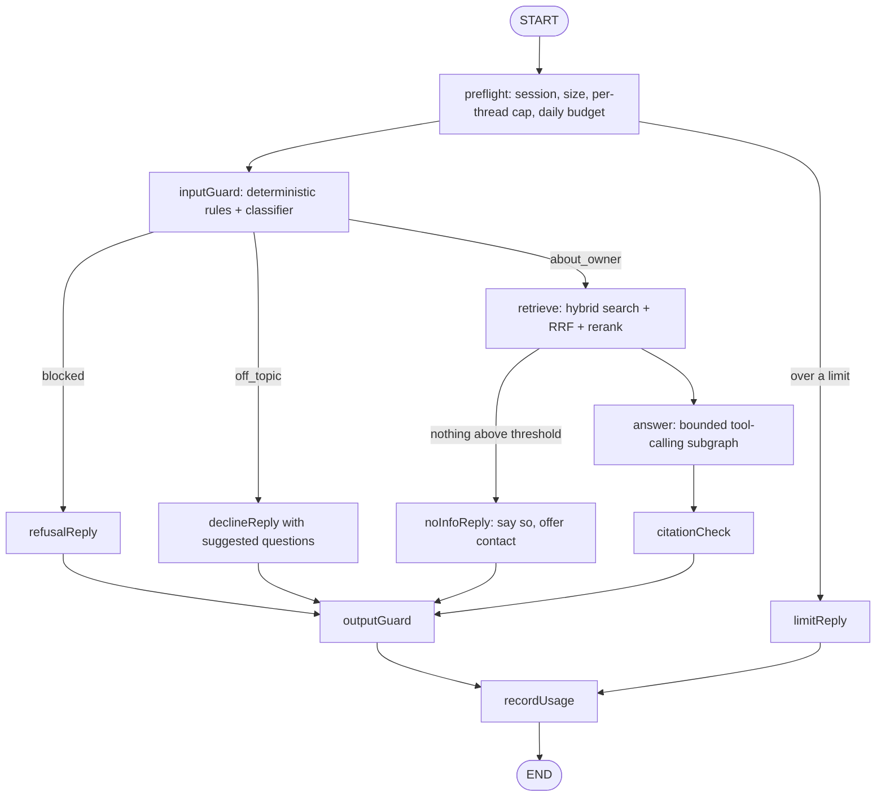

# ADR-015: Agent graph shape

**Status:** Accepted (owner review 2026-10-03, D-15).

Decided by the owner in the plan review of 2026-10-02 and 2026-10-03 (decisions D-15). This record was extracted verbatim from `docs/plan/report.md`; the narrative, traces and sources stay there. From now on this file is the canonical record: a new decision is a new ADR that supersedes this one, never an edit.

## Considered options

- *A. Prebuilt `createAgent` (ReAct loop) with middleware.* Pros: a few lines; middleware gives call limits, PII redaction, custom hooks. Cons: the model decides whether to retrieve or refuse; safety lives in prompt and middleware order; teaches less of LangGraph itself.
- *B. Fixed workflow:* guard, retrieve, generate, check. Pros: predictable, cheapest. Cons: no multi-step lookups ("which projects used NestJS, and which of them has tests?").
- *C. Custom `StateGraph` with deterministic nodes around a bounded agent subgraph.* Guards, routing, retrieval and checks are code; inside, a small tool-calling agent (built with `createAgent` and its limit middleware, used as a subgraph) can make follow-up lookups.

## Decision

C.

## Structure update (amended 2026-10-02)

the bounded answer subgraph below becomes the CV agent, one of two specialists under a supervisor (ADR-039); the other is the recruiter agent (ADR-032). Guard, retrieval, citation and output nodes stay shared.

## State (StateSchema with Zod)

`messages` (MessagesValue), `locale`, `intent`, `verdict`, `sources` (retrieved chunks with ids), `usage` (ReducedValue summing tokens), `flags` (guard events).

## Tools (all read-only)

`searchKnowledge(query, kind?)`, `getProject(slug)`, `listProjects(filter)`, `getExperience()`, `getContactOptions()`, and (amended 2026-10-02, ADR-031) `getEntriesForCvBullet(bulletId)` and `getKnowledgeEntry(entryId, section?)`. Inputs are Zod schemas from `packages/contracts`; outputs are JSON-encoded and marked as data.

## Limits

`modelCallLimitMiddleware` (run limit 3), `toolCallLimitMiddleware` (run limit 4), `max_tokens` 600, history window of the last 6 messages, 500 characters per user message.

## Why retrieve before the agent instead of only as a tool

most questions need the same first search; doing it deterministically saves one model round trip per turn (about 40% of the cost) and guarantees the answer is grounded even when the model would have skipped the search. The tools remain for follow-ups.

## Pattern names

workflow vs agent (Anthropic, "Building effective agents"), router, gatekeeper/guard node, ReAct loop, corrective RAG (relevance threshold with a fallback path), circuit breaker (budget preflight).
