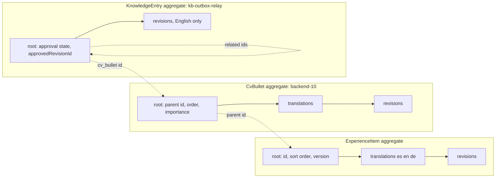
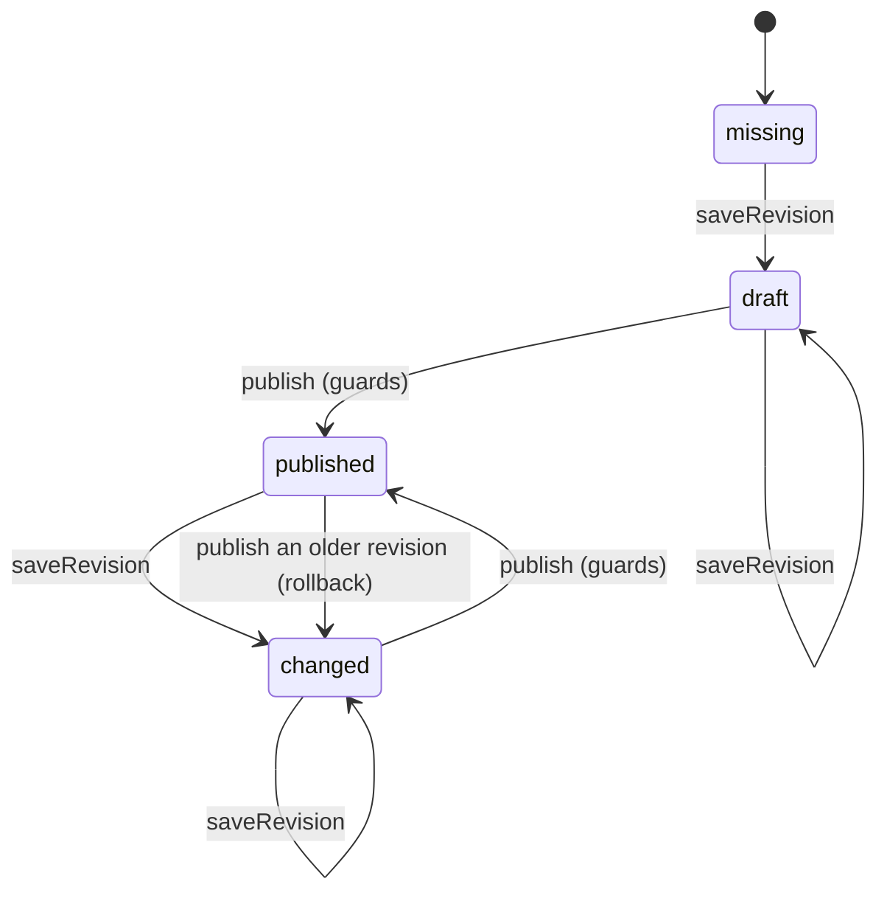
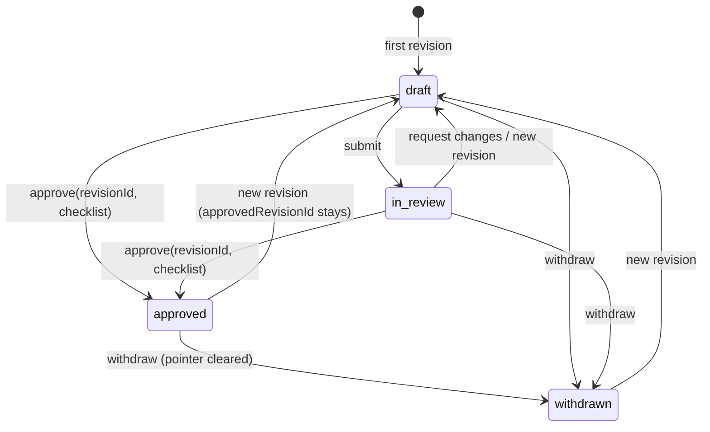
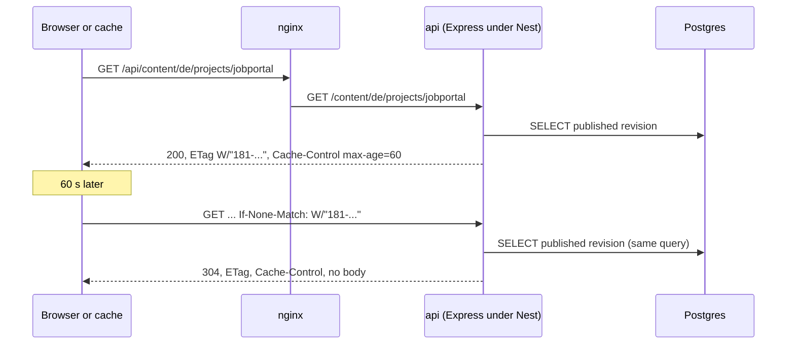

# WP-12: Content domain and public API

Issue #20, branch `wp/12-content-domain`, release R1, size L, tag learning. Depends on WP-10 (done). Unblocks WP-16 (the public pages), WP-13 (admin login), WP-14 (content events) and WP-35 (the entry importer).

Deliverable (report section 14): the `content` module in `api`, hexagonal (ADR-003): the content aggregates (profile, experience items, projects, posts, skills) with their translations and revisions and a per-locale publish state machine; CV bullets and knowledge entries with the approval state machine bound to a revision (ADR-031); persistence on WP-10's data layer; the use cases (save a revision, publish, approve, withdraw); and the public read endpoints with cache headers, their Zod contracts in `packages/contracts`. Step 1 first removes WP-10's duplicated test helpers.

What the owner learns (decisions.json): domain modeling, aggregate boundaries, state machines, HTTP caching.

**Out of scope, accepted at `/wp`:** events and outbox rows on publish and approval (WP-14), the entry importer (WP-35), admin login and guards (WP-13), the admin UI (WP-17), the pages that read this API (WP-16). The public read endpoints and their contracts are the priority output, because WP-16 waits for them.

**What you already know, and what is new.** The repository behind a port, the unit of work, `withTransaction` and the version column come from WP-10 (`docs/learning/wp-10.md`, D5 and D6); problem details and request validation from WP-3 (Trace 2); Zod contracts and expand/contract from WP-5 (C10 and the step log). This file spends its words on what is new: where one aggregate ends and the next begins, revisions as a history with a pointer, a state machine whose guards are the business rules, and what HTTP caching actually buys when the main reader (`web`) has its own cache.

**One wording note.** Issue #20 and the report's WP row say "knowledge entries with per-locale approval". ADR-031's alignment bullet (2026-10-02) changed that: entries are English only, so approval is per entry. This file follows the ADR.

## Decisions explained

### D1. Why one aggregate per content item, with its translations and revisions, and not one big tree or one aggregate per translation?

**Problem.** An aggregate is the unit that is loaded, changed and saved as one, inside one transaction, with its rules checked together. Draw it too big and unrelated edits collide and every load drags half the database; draw it too small and a rule that spans two pieces can no longer be checked in one place.

**Example.** The experience item "Backend engineer, 2024 to now" has 6 CV bullets, and each bullet is detailed by about 3 knowledge entries. As one aggregate, fixing a German typo in bullet `backend-10` loads 6 bullets in 3 locales plus 18 entries, and bumps one version number for all of it: an approval of `kb-outbox-relay` in another tab then fails with a conflict although nobody touched that entry. The other extreme, every translation its own aggregate: the rule "a project may go public only when its Spanish and English versions are publishable" (D-20) now spans three aggregates, so no single object can refuse a bad publish.

**Decision (ADR-011, ADR-031, ADR-003).** One aggregate per content item: `Profile`, `ExperienceItem`, `Project`, `Post`, `Skill`, `CvBullet` and `KnowledgeEntry`. Each owns its translations and its revisions, because the publish rule spans them. Aggregates point at each other by id only: a CV bullet names its parent experience item or project; an entry names at most one CV bullet (`cv_bullet` in the agreed file format) and its `related` entries; the list of entries under a bullet is a reverse lookup, never a field (ADR-031 alignment). The aggregate loads its per-locale state and the latest revision of each locale, not its whole history.



**Why `CvBullet` is not part of `KnowledgeEntry` or of `ExperienceItem`.** They differ in everything an aggregate is for: a bullet is short, translated into three languages and published per locale; an entry is long, English only, and approved per entry with a checklist; they are written at different times (WP-52) and changed by different use cases. A bullet is also addressed on its own: the agent's drill-down sends its `bulletId` (ADR-031), entries link to it, the PDF CV picks bullets by importance. Something addressed from outside by its own id is a root, not a child.

**Alternatives.**
- *One aggregate per experience item, holding its bullets and their entries.* Discarded: the false conflicts and the loads of the example, for a rule (bullet order) that a unique index can guard. Wins when the children have no identity outside the parent and are always edited together: the lines of an order, the answers of one form.
- *`CvBullet` as a child entity of `ExperienceItem`.* Discarded: bullets are referenced by id from outside and published per locale on their own. Wins when bullets are only ever edited as one ordered list and never addressed alone.
- *Each translation its own aggregate.* Discarded: the publish rule spans languages. Wins when each language has its own team and workflow, as in a translation management system.
- *One generic `ContentItem` with a `kind` field and free-form fields.* Discarded: the rules differ per type (entries have approval, posts have a publish date, projects have kinds), so every rule becomes a runtime switch, and ADR-011 asks for a base table per aggregate. Wins in a CMS where editors define types at runtime (Payload, Strapi).

**Patterns:** aggregate, aggregate root, consistency boundary, invariant, reference by identity, small aggregates.

### D2. Why revisions as an append-only history with a published pointer, and not draft and published tables?

**Problem.** The owner edits content that is already public. The edit must not show until it is published, the published version must keep working meanwhile, and "what did the site say on 3 November" must have an answer, because what is published is also what the agent was told (ADR-011 consequences: only published revisions are indexed).

**Example.** The German version of project `jobs-hub` is published at revision 6. The owner saves a better summary: revision 7. The site keeps showing 6. Publish moves the German pointer to 7. A mistake is found: publishing revision 6 again is the rollback, one pointer move, no copying.

**Decision (ADR-011).** Every save appends a revision; revisions are never updated. Per item and locale, a pointer says which revision is published (`published_revision_id`), and another which is the latest. "Draft" and "published" are states of the aggregate derived from those pointers, not two tables. What a revision holds and how it is stored is open question Q1.

**Alternatives.**
- *Two tables, drafts and published copies; publish copies the row.* Discarded: two schemas to keep identical, history lost, and ADR-011 says not two tables. Wins when there is no history requirement and the read path must be the simplest possible.
- *One mutable row with a `status` column.* Discarded: editing published content either changes the live text at once or takes it offline while you edit. Wins for content that is never edited after publishing (a changelog entry).
- *Event sourcing* (store every change as an event, rebuild state from them). Discarded: projections and replays for a history nobody queries field by field. Wins when every change must be auditable and queried over time (ledgers, regulated records).
- *Temporal tables* (the database keeps old row versions with validity periods). Discarded: Postgres has no built-in system versioning, and drafts are not old rows but future ones. Wins when history of plain rows is enough and the database supports it natively.

**Patterns:** append-only history, versioning, current-version pointer (copy-on-write), snapshot, rollback by pointer.

### D3. Why a base table plus a per-locale table, and not a column or a JSON field per language?

**Problem.** Content exists in `es`, `en` and `de`. Some fields depend on the language (title, body, the URL slug), some do not (the canonical slug, the display order). Where language lives decides how hard it is to add a locale, to enforce "Spanish and English before publishing" (D-20) and to find a page by its localized slug.

**Example.** Project `jobs-hub` is "Portal de empleo" at `/es/proyectos/portal-de-empleo`, "Jobs hub" at `/en/projects/jobs-hub`, and has no German version yet. The request for `/es/proyectos/portal-de-empleo` must find the project by the pair (es, `portal-de-empleo`), and two Spanish projects may never share a slug.

**Decision (ADR-011, ADR-022, D-20).** A base table per aggregate (`content.projects`) plus a `*_translations` table keyed by `(project_id, locale)`. In this design the translations row holds the per-locale state: the latest and published revision pointers, the published slug and the publish time; the text itself lives in the revision it points at (D2). This is this file's reading of ADR-011, which names the table and its key but not its columns. A unique index on `(locale, published_slug)` finds a page by its URL and forbids duplicate slugs per language. Completeness is per locale: es and en must be publishable, de is warned (D-20). Knowledge entries are English only (ADR-031 alignment), so they have no translations table; Spanish and German visitors are served by the agent's multilingual retrieval (D-66), not by this module.

**Alternatives.**
- *A column per language* (`title_es`, `title_en`, `title_de`). Discarded: a fourth locale is a migration on every table, and most columns are nullable. Wins with two fixed languages and a tiny schema.
- *A JSON field per translated field* (`title: {"es": ..., "en": ...}`). Discarded: per-locale uniqueness of slugs and "required locales" become application checks or expression indexes. Wins with many locales and few queries by field.
- *A generic translations table* (`entity, field, locale, value`). Discarded: no types, no constraints, one join per field; the entity-attribute-value anti-pattern. Wins when fields are defined at runtime.
- *One item per language, grouped by a shared id* (how some WordPress plugins do it). Discarded: neutral fields duplicated and drifting, and the publish rule crosses items. Wins when language versions differ in structure, not just text.

**Patterns:** translation table (entity plus per-locale rows), completeness check, natural key per locale (`(locale, slug)`).

### D4. Why state machines bound to a revision, and not a `published` or `approved` boolean?

**Problem.** Publishing and approving are the two controls that decide what visitors read and, through WP-14, what enters the agent's index (ADR-011, ADR-031, the LLM04 data poisoning control). A boolean says "this item is approved" but not "which text was approved". The first edit after approval then either keeps the flag (unreviewed text goes public and, later, to the agent) or clears it (the page disappears while you fix a typo).

**Example.** Entry `kb-outbox-relay` revision 3 was checked against the five-box checklist and approved. The owner re-imports the file with a new paragraph: revision 4. With `approved = true` on the entry, revision 4 is public at once, unchecked, which is exactly the leak ADR-031's gate exists to stop. With approval bound to a revision, `approvedRevisionId` still says 3: the work-log page and the agent keep revision 3 until revision 4 is approved.

**Decision (ADR-011, ADR-031, D-20).** Two small state machines in the domain layer, plain TypeScript, each transition a method that checks its guards and refuses with a domain error otherwise.

*Publish, per item and locale* (profile, experience items, projects, posts, skills, CV bullets). The per-locale state is derived from the pointers: `missing` (no revision), `draft` (revisions, none published), `published` (published = latest), `changed` (published is older than latest; visitors see the published one). An item-level `archived` hides every locale.



Guards on `publish(locales)`: each named locale has a complete revision (its required fields filled); after the publish, `es` and `en` are both published, so an item never goes public in one required language only; `de` may stay out, which the result reports as a warning (D-20). Publishing an older revision of a locale is allowed: that is the rollback of D2.

*Approval, per knowledge entry* (English only, so per entry; ADR-031 alignment). States `draft`, `in_review`, `approved`, `withdrawn`, plus the pointer `approvedRevisionId`, which is what the public reads. The state describes the latest revision; the pointer describes what is live. They differ on purpose: an approved entry edited again is `draft` with `approvedRevisionId` still set.



Guards on `approve(revisionId, checklist)`: `revisionId` is the latest revision (you approve the text you read; a newer revision means someone changed it since your preview, the two-step approval of D-62 relies on this); all five checklist boxes are true (ADR-031); the entry is not withdrawn without a newer revision. Approval records the revision, the time and the checklist answers. `withdraw` clears the pointer at once. The importer (WP-35) calls the same `approve` method when the file says `approved: true` and its checks pass (D-65), so there is one road to approval.

**Alternatives.**
- *A boolean flag.* Discarded for the reason in the example; ADR-031 option C names it ("easier to flip by mistake"). Wins for low-risk toggles with no text behind them, such as `featured`.
- *A status column without a pointer* (`draft | published`). Discarded: editing published content needs a second copy somewhere, which is D2's problem again. Wins when published content is never edited.
- *A state machine library* (XState). Discarded: two machines of four states fit a transition method each; the domain layer imports no npm package (rule `domain-imports-only-domain`). Wins with many states, nested or parallel states, timers, or a UI flow that benefits from its visual tools.
- *The GoF state pattern* (one class per state). Discarded: four tiny classes per machine for no gain. Wins when each state carries a lot of distinct behavior.
- *A workflow engine* (Temporal, BPMN). Discarded: no long waits, no multiple actors. Wins for long-running processes with timers, retries and human steps across services.

**Patterns:** finite state machine, transition guard, invariant, approval bound to a revision, derived state, tell, don't ask.

### D5. Why a version column on every aggregate, and not locks or last write wins?

Announced in WP-10 (D6: "concurrent edits of one aggregate are caught by a version column in WP-12"); first used here.

**Problem.** Two edits of the same item, loaded at the same time, both save. Without a check the second silently overwrites the first: the lost update.

**Example.** The admin is open in two tabs on project `jobs-hub`, both loaded at version 5. Tab A saves a German revision: version 6. Tab B saves a Spanish change built on version 5. Its `UPDATE content.projects SET version = 6 WHERE id = $1 AND version = 5` matches 0 rows, so the use case throws `ConcurrentModification`, and because the revision insert ran in the same unit of work, it rolls back too (the same atomicity WP-10's step 7 proved for the outbox).

**Decision (WP-10 D6, recorded).** Each aggregate root has `version integer`. Every write use case takes the version the caller loaded (`expectedVersion`), the repository updates `WHERE version = expected`, and 0 rows means a conflict. Default isolation stays `READ COMMITTED`.

**Alternatives.**
- *Pessimistic lock* (`SELECT ... FOR UPDATE` held while the owner edits). Discarded: a human edit lasts minutes; a lock cannot span HTTP requests. Wins for short, contended server-side updates (WP-5's outbox claim uses `FOR UPDATE SKIP LOCKED`).
- *Last write wins.* Discarded: silent data loss. Wins for idempotent overwrites where any recent value is fine (a "last seen" timestamp).
- *Stricter isolation* (`SERIALIZABLE`). Discarded: it protects one transaction, not a human's load-then-save across two requests. Wins for concurrent multi-row invariants inside one transaction.

**Patterns:** optimistic concurrency, version column, lost update, compare-and-set. Over HTTP the same idea is `If-Match` with a `412 Precondition Failed` (D6's validators, used for writes), a natural shape for WP-13's endpoints.

### D6. Why Cache-Control with ETag and 304, and not no caching or a long cache with purge?

**Problem.** Public reads should not cost a database query per visitor, and a publish must show up within seconds; an old page served after a publish is a bug. Several caches sit between Postgres and a visitor, and each obeys different signals. Before choosing headers, it matters who reads them.

**Who reads this API, checked in the code:**
- `web` (Next.js 16), server-side, the main reader. Its data cache is driven by the options of its own `fetch` calls (`cache`, `next.revalidate`, `next.tags`); it never sends `If-None-Match` (no such logic in `next/dist/server/lib/patch-fetch.js` of 16.3.8), and by a grep of the same file it does not read the API's `Cache-Control`. Freshness for `web` comes from tags: WP-14's `api-worker` calls `revalidateTag` after a publish (report section 3.4).
- nginx, if a later WP caches `/api/content/` (WP-16 caches pages). It obeys the upstream `Cache-Control`, including `stale-while-revalidate` and `stale-if-error`, and with `proxy_cache_revalidate on` it revalidates with `If-None-Match` (nginx docs).
- Browsers and anyone else calling `jadero.dev/api/content/...` directly: the route is public through nginx.

**Example.** A browser asks for `GET /content/de/projects/jobportal`, gets 200 with `ETag: W/"181-W/tDlxKI1HXR9L4BcC5erYz/hl4"` and `Cache-Control: public, max-age=60, ...`. For 60 seconds it reuses the copy without asking. Then it asks again with `If-None-Match: W/"181-..."`; if nothing was published, `api` answers `304 Not Modified` with no body. If the German revision 7 was published meanwhile, the body changed, so the ETag changed, and it gets 200 with the new text.

**Decision (report section 14 WP-12 row "public endpoints with cache headers", section 3).** Every public read answers with `Cache-Control: public, max-age=60, stale-while-revalidate=300, stale-if-error=86400` and an `ETag`, and answers a matching `If-None-Match` with 304. The values are implementation choices below. The ETag is the one Express 5 already computes: for every `res.send` it hashes the body into a weak ETag and turns a 2xx into 304 when the request is fresh (`express/lib/response.js` 5.2.1), and Nest's Express adapter sends every object through `res.json`, which calls `res.send`. So 304 works today with no code; this WP adds `Cache-Control`, tests the behavior, and makes errors `no-store` so a 404 is never cached past a publish.

The honest limit: a body-hash ETag saves bandwidth and parsing, not work, because `api` runs the query and builds the body before it can hash it. Saving the work needs a validator computed before the work (alternative 2).



**Alternatives.**
- *No cache headers* (or `no-store`). Simplest, always fresh, a query per request. Discarded: it teaches nothing about the WP's subject and leaves any cache in front without instructions (caches may then apply heuristics). Wins for private or per-user data (the admin endpoints of WP-13 get `no-store`).
- *A validator from the data* (`ETag: "<published revision id>"`, checked before loading the body). Saves the query and the serialization on a 304. Discarded for now: one indexed query per read is cheap here, and a hand-made ETag must change whenever the response shape changes, or a client keeps an old shape. Wins when building the body is expensive (large lists, server-side Markdown rendering).
- *Long cache plus purge on publish* (`s-maxage=86400`, and WP-14 purges the cache entry). Freshest and cheapest, but needs a purge mechanism in the cache; nginx open source has no built-in purge (**verify**). Wins with a CDN that supports tag purges (surrogate keys); Next's `revalidateTag` is this idea inside `web`.
- *`Last-Modified` and `If-Modified-Since`.* One-second resolution and no single date for a list. Wins for static files (nginx does it for files).
- *An application cache in `api`* (Redis). Discarded: no Redis in the stack, and an indexed read is fast. Wins for expensive queries with many readers.

**Patterns:** HTTP conditional request, validator (ETag, weak versus strong), freshness lifetime, stale-while-revalidate, stale-if-error, tag-based invalidation (WP-14), cache stampede protection (`proxy_cache_lock`, if nginx caches it).

## Open questions

Two choices no ADR decides. Q1 shapes every table and the payload WP-14 will publish; Q2 decides what an unauthenticated client can reach in staging.

### Q1. What is one revision, and how is it stored?

**What you need first.** A revision is the snapshot a save creates (D2), published per locale. Some fields are translated (title, body, localized slug), some are the same in every language (a project's repository URL, its stack tags; an experience item's organization name). ADR-011 says two things that constrain the answer: "every save creates a revision" and, in its consequences, text about the owner becomes public only through publish ("any text about the current role enters only through this publish step"). WP-14's `content.published.v1` carries the whole published translation (report section 3.4), so the revision's content is also the future event payload.

**Example.** The owner adds "Redis" to the stack tags of `jobs-hub`, which is published in es, en and de. Where does that change live, and when does a visitor see it?

**Options.**
- *A. A revision is one locale's full item, in a revision table per type with typed columns.* `content.project_revisions (id, project_id, locale, number, slug, title, summary, body, repo_url, stack_tags, ...)`. A neutral-field change creates a new revision in every locale (copied), and goes public as each locale is published. The database enforces field rules (`NOT NULL`, `CHECK`), and a composite foreign key proves a published pointer names a revision of the same item and locale. Cost: seven revision tables with different columns, a migration for every new field, a mapper per type. Wins when you filter or index on fields inside revisions, or want the database to guard each field.
- *B. Same unit (one locale's full item), but the content is one `jsonb` document; one identical revision table per type, built by one Drizzle factory.* `content.project_revisions (id, project_id, locale, number, document jsonb, created_at)`. The document is checked by the type's Zod schema in `infrastructure/` on write and on read. Same foreign keys as A, because each type keeps its own table. A new optional field needs no migration; old documents must still parse (tolerant reader, the same rule as events in WP-5). The document is exactly what WP-14's event carries. Cost: field rules live in the domain and Zod, not in SQL; a filter inside a document is `document->>'title'`. Wins when revisions are immutable snapshots read whole, which they are here.
- *C. One shared `content.revisions` table for every type* (`item_type`, `item_id`, `document`). Fewest tables. Cost: the foreign key from a revision to its item is impossible (one column pointing at seven tables, the polymorphic association anti-pattern), so the database no longer proves a pointer belongs to its item. Wins when types are added at runtime.
- *D. Neutral fields live on the base row, not in revisions; revisions hold translated fields only.* Simplest editing: change the stack tags once. Cost: a neutral change goes live on save, with no publish and (in WP-14) no event, so the agent's copy drifts, and text such as an organization name bypasses publish. **This departs from ADR-011** (only publish makes text public) and would need a superseding ADR. A variant gives the neutral part its own revision stream and pointer: consistent, but two pointers to keep in step on every publish. Wins when neutral fields are large or edited often and are not statements about anyone.

**Patterns:** snapshot, document per version, tolerant reader, polymorphic association (anti-pattern), schema-on-read versus schema-on-write.

**Question 1.** What is one revision and where is it stored: A, B, C or D?

### Q2. Do the admin write endpoints arrive in this WP, or with WP-13?

**What you need first.** After step 6 the use cases exist (save a revision, publish, approve, withdraw). The admin login (Better Auth, GitHub allow-list, nginx `auth_request`) is WP-13; the admin UI that would call these endpoints is WP-17, which waits for WP-13 and WP-14. WP-16 needs only the public reads, plus some content to show. ADR-008 names the risk: whoever can publish can also feed the agent's index (data poisoning, LLM04). Issue #20's definition of done says "deployed to staging", and staging (`new.jadero.dev`) is on the public internet. There is a precedent: `POST /dev/ping` exists only when `NODE_ENV=development` (WP-5 decision W1 c).

**Example.** Staging runs this WP's image. If `POST /content/projects/jobs-hub/publish` is routed and unguarded, anyone who guesses the path can publish text that WP-14 will later carry to the agent.

**Options.**
- *A. No write endpoints in WP-12.* The use cases are proven by unit and integration tests; a seed command (`pnpm --filter @jadero/api db:seed`) loads placeholder content through the same use cases, so WP-16 has data locally and on staging. WP-13 adds the write controllers and the guard together, with their 401 and 403 tests. Nothing writable is ever deployed unguarded. Cost: no curl-able writes until WP-13. Wins when auth is one WP away and nobody needs to edit through HTTP yet.
- *B. Write controllers now, registered only in development* (like `/dev/ping`). You can curl them locally; WP-13 registers them always, behind the guard. A test asserts they answer 404 in production mode. Cost: the security of the write path rests on an environment flag until WP-13. Wins when local manual testing through HTTP matters, and the flag pattern is already trusted.
- *C. Write controllers now, behind a temporary guard* (a static bearer token from the config, compared in constant time). Staging becomes editable. Cost: a secret to provision, a second auth path that WP-13 must remember to delete; temporary guards tend to stay. Wins when someone must edit staging content before real auth exists.
- *D. Write controllers now, unguarded, trusting nginx not to route them.* One config mistake exposes publish. Departs from ADR-008's intent. Wins nowhere outside a throwaway prototype on a private network.

**Patterns:** secure by default, feature flag (and its risk as a security control), seed data, walking skeleton.

**Question 2.** Do the write endpoints arrive now (B, C or D) or with WP-13 (A)?

### Recommendations

Read after answering.

- **Q1: B.** Revisions are immutable snapshots that are always read whole, which is what a document column is good at; each type keeps its own small table, so the foreign keys still prove that a published pointer names a revision of the same item and locale (C loses that); one factory builds the seven tables, so this is less code than A; and the document is the event payload WP-14 publishes, so the tolerant-reader rule you already apply to events covers stored revisions too. Under B the base row keeps only identity and what states nothing about the owner: canonical slug, kind, display order, `featured`, a CV bullet's importance, the version and the archive mark. These change without a revision, which reads ADR-011's "every save creates a revision" as covering content, not layout; object if you read it strictly, and those fields move into the document too. Second choice: A, if you want the database to guard every field. D departs from ADR-011.
- **Q2: A, with the seed command.** Nothing unguarded is ever deployed, WP-13 builds each write endpoint with its guard and its auth tests in one place, and WP-12 is already size L. B is reasonable if you want to curl writes locally; then the 404-in-production test is required, not optional. C and D add risk for no need here.

## Implementation choices

What WP-12 builds, assuming the recommendations. Object to any line.

- **Step 1, shared test helpers:** a new private package `packages/testing` (`@jadero/testing`, TypeScript built like the others, a dev dependency only) with the Postgres global setup, `createTestDatabase({ superuserExtensions?: ["vector"] })` (the agent's `vector` case becomes an option instead of a fourth variant), the Docker host detection, the image constants with their compose check, and `pendingSchemaChanges({ root, config })` taking the service's drizzle config as an argument. Not `@jadero/config`: it is plain JSON and JavaScript with no build by design, every package depends on it (`web`, `ui` too), and these helpers need types plus `testcontainers`, `pg` and `drizzle-kit`. Not `platform-nest`: it is runtime bootstrap, and `messaging` does not depend on it. Infrastructure only, no domain, and it never imports `apps/` (rules `shared-packages-hold-no-domain`, `no-domain-in-shared-packages`). The RabbitMQ setup stays in `messaging`, its only user.
- **Module:** `apps/api/src/modules/content/`, hexagonal, from the template's widgets shape; one unit of work port for the module; its tables in the Postgres schema `content`.
- **Types in this WP:** `Profile` (singleton), `ExperienceItem`, `Project`, `Post`, `Skill`, `CvBullet`, `KnowledgeEntry`. `Media` waits for upload (WP-17); image fields are left out until then.
- **Locales:** a `Locale` value object (`es`, `en`, `de`) and the required set `{es, en}` as a domain constant (D-20); `de` missing is a warning in the publish result.
- **Fields per type:** ADR-011's first cut for the content types; for entries the agreed file format wins (ADR-031 alignment): `type` from the format's list, the nine headings as sections, `stack`, `patterns`, `related`, `cv_bullet`, plus `indexable` (default true, D-52).
- **Private entry fields:** `sources`, `conflicts`, `public_names` and `confidence` are stored for the owner and never leave `api` (D-67): the public query does not select them and the response schema drops unknown keys anyway (two independent guards).
- **Ids:** UUIDv7 from the `IdGenerator` port for items and revisions (WP-10 rule); CV bullets and entries keep their human ids as primary keys (`backend-10`, `kb-...`), because ADR-031 makes them the identity used in files, citations and URLs, and that wins over the WP-10 default; their rows are never hard-deleted, so an id is never reused (D-65 "delete" becomes a tombstone that the public reads hide).
- **Slugs:** a canonical slug on the base row (stable, for admin routes and events); a localized slug per published locale, unique per `(locale, published_slug)` and type.
- **Revision numbers:** per item and locale, computed by the aggregate from the latest one, backed by a unique `(item, locale, number)`.
- **Clock:** a `Clock` port for `publishedAt` and `approvedAt`, so the state machine tests pin time.
- **Domain errors:** `RevisionNotLatest`, `LocaleIncomplete`, `RequiredLocalesMissing`, `ChecklistIncomplete`, `InvalidTransition`, `ConcurrentModification`; mapped to 422 or 409 problem details when write endpoints exist (WP-13).
- **No per-locale unpublish:** archiving hides the whole item; unpublishing one required locale would break D-20, and nothing asks for unpublishing German alone.
- **CV bullet links:** on approval the entry's `cv_bullet` is copied to a column on the entry's row, so "entries under `backend-10`" is one indexed query; no foreign key to `cv_bullets`, because an entry may name a bullet that does not exist yet (the coverage view of WP-17 flags it); public reads return only approved entries.
- **No domain events yet:** `publish` and `approve` return what changed (item, locales, revision ids); WP-14 turns that into outbox rows inside the same unit of work.
- **Public reads through a query service:** read-only SQL that returns contract DTOs straight from the published pointers, not through the aggregates (the CQRS read side WP-10 D5 deferred to this WP); writes go through repositories and the unit of work.
- **Routes:** `GET /content/:locale/profile`, `/experience` (items with their published CV bullets, each with the ids of its approved entries), `/projects?kind=`, `/projects/:slug`, `/posts?cursor=`, `/posts/:slug`, `/skills`, and `GET /content/work`, `/content/work/:entryId` for approved entries (English only, no locale segment). nginx maps `/api/content/` to them later.
- **Locale in the path, never negotiated** from `Accept-Language`: one URL per representation, so caches need no `Vary`.
- **German fallback:** when `de` is not published, the response carries the English version with `"locale": "en"` and `Content-Language: en`; WP-16 decides how to show it.
- **Alternates:** every item lists its published slugs per locale (`alternates`), for WP-16's `hreflang`.
- **Markdown:** bodies are stored and returned as Markdown text; rendering and sanitizing happen in `web` (ADR-011).
- **Lists:** posts use keyset pagination on `(published_at, id)`, 20 per page, an opaque cursor (the WP-10 rule); other lists hold dozens of rows and are not paginated, ordered by display order then id.
- **Contracts:** response and parameter schemas in `packages/contracts` (`content/` folder); responses pass through Nest's `StandardSchemaSerializerInterceptor`, which replaces the body with the parsed value; a response that fails its schema is a 500 with the details in the log only. No version segment in the paths: changes are additive, and WP-51's breaking-change check guards them; a breaking change would add new routes next to the old ones (expand/contract, as for events).
- **Cache headers:** public 200s get `Cache-Control: public, max-age=60, stale-while-revalidate=300, stale-if-error=86400` (a publish reaches any shared cache within about a minute; a cache may cover an `api` outage for a day) and `Content-Language`; the ETag stays Express's weak body hash; the problem-details filter in `platform-nest` adds `Cache-Control: no-store` to every error, in every service.
- **Seed (Q2 A):** `pnpm --filter @jadero/api db:seed` (`node dist/seed.js`, like `db:migrate`), idempotent, placeholder public-level content only, through the use cases so seeded data passes the same rules; real content arrives through WP-35 and WP-17.
- **Tests:** table-driven unit tests for every transition and guard of both machines (aiming at ADR-009's 90% lines and 85% branches for domain and application); one contract suite per repository run on the in-memory and Drizzle adapters; Testcontainers for the pointer foreign keys, the slug uniqueness, the version conflict with rollback, and the public queries; supertest end-to-end for each public route, including 304, 404 with `no-store`, 400 for an unknown locale, and private entry fields absent.
- **Fixtures:** placeholder names only, never the employer's internals (ADR-031, AGENTS.md section 7).
- **Migration:** one generated migration in `apps/api/drizzle/` for the `content` schema, reviewed as SQL in the PR.

## One concrete trace

The tables follow Q1 B and Q2 A. Ids are UUIDv7 with real time prefixes; the ETags were computed with `etag` 1.8.1 over these exact bodies (Facts checked). Under Q2 A the commands come from a test or the seed, not from HTTP.

### Trace 1: a German revision is saved, published and read, then revalidated

State before: project `jobs-hub` (id `01a0f6b2-...`, version 5), es and en published, de published at revision 6 (`01a15889-fa80-7c3a-9d2e-5f6a7b8c9d0e`).

1. A visitor's browser asks for the German page data. nginx forwards `GET /content/de/projects/jobportal`. The query service runs:
   ```sql
   SELECT p.slug AS canonical_slug, p.kind, r.id AS revision_id, r.document, t.published_at
   FROM content.project_translations t
   JOIN content.projects p ON p.id = t.project_id
   JOIN content.project_revisions r ON r.id = t.published_revision_id
   WHERE t.locale = 'de' AND t.published_slug = 'jobportal' AND p.archived_at IS NULL;
   ```
   plus one query for the other locales' published slugs (`alternates`). The answer, 373 bytes: `200`, `Content-Type: application/json; charset=utf-8`, `Cache-Control: public, max-age=60, stale-while-revalidate=300, stale-if-error=86400`, `Content-Language: de`, `ETag: W/"175-dnpuN6tmVVWyjl5fSNpO+5hBsSU"`.
2. The owner's tool calls `SaveProjectRevision.execute({ projectId, locale: "de", expectedVersion: 5, content: { slug: "jobportal", title: "Jobportal", summary: "Eine Jobbörse mit Volltextsuche und Filtern.", body: "## Problem\n...", stackTags: ["NestJS", "PostgreSQL"], repoUrl: null, demoUrl: null } })`.
3. The use case runs `uow.run(async ({ projects }) => { const project = await projects.get(projectId); project.saveRevision("de", content, ids.next(), clock.now()); await projects.save(project, 5); })`. The domain checks the format of the fields present (slug format; an empty title is fine in a draft, completeness is checked at publish) and computes number 7; German moves from `published` to `changed`.
4. The Drizzle adapter, on one connection:
   ```sql
   BEGIN;
   SELECT ... FROM content.projects WHERE id = $1;                    -- version 5
   SELECT ... FROM content.project_translations WHERE project_id = $1; -- es, en, de
   SELECT ... FROM content.project_revisions WHERE id = ANY($2);       -- the three latest
   INSERT INTO content.project_revisions (id, project_id, locale, number, document)
     VALUES ('01a1a0e4-7850-7d22-a6b1-0c1d2e3f4a5b', $1, 'de', 7, '{"slug":"jobportal",...}');
   UPDATE content.project_translations SET latest_revision_id = '01a1a0e4-7850-...'
     WHERE project_id = $1 AND locale = 'de';
   UPDATE content.projects SET version = 6 WHERE id = $1 AND version = 5;  -- 1 row
   COMMIT;
   ```
5. A visitor asking now still gets revision 6: the published pointer did not move.
6. `PublishProject.execute({ projectId, locales: ["de"], expectedVersion: 6 })`. Guards: de's latest revision is complete; after the publish es and en are still published. Result: `{ published: [{ locale: "de", revisionId: "01a1a0e4-7850-..." }], warnings: [] }`.
7. SQL, one transaction:
   ```sql
   UPDATE content.project_translations
     SET published_revision_id = '01a1a0e4-7850-...', published_slug = 'jobportal', published_at = now()
     WHERE project_id = $1 AND locale = 'de';
   UPDATE content.projects SET version = 7 WHERE id = $1 AND version = 6;
   -- WP-14 adds here: INSERT INTO messaging.outbox (... 'content.published.v1' ...), same transaction
   ```
   The composite foreign key `(project_id, locale, published_revision_id)` to `project_revisions (project_id, locale, id)` proves the pointer names a German revision of this project.
8. The browser's copy is now older than 60 seconds; it sends `If-None-Match: W/"175-dnpuN6tmVVWyjl5fSNpO+5hBsSU"`. The query returns revision 7, Express hashes the new 385-byte body into `W/"181-W/tDlxKI1HXR9L4BcC5erYz/hl4"`, which does not match, so the answer is `200` with:
   ```json
   {"slug":"jobportal","locale":"de","title":"Jobportal","summary":"Eine Jobbörse mit Volltextsuche und Filtern.","body":"## Problem\n...","kind":"project","stackTags":["NestJS","PostgreSQL"],"repoUrl":null,"demoUrl":null,"publishedAt":"2026-11-03T10:12:00.000Z","revisionId":"01a1a0e4-7850-7d22-a6b1-0c1d2e3f4a5b","alternates":{"es":"portal-de-empleo","en":"jobs-hub","de":"jobportal"}}
   ```
9. The next request with `If-None-Match: W/"181-W/tDlxKI1HXR9L4BcC5erYz/hl4"` gets `304 Not Modified`, with `ETag` and `Cache-Control` repeated and no body (RFC 9110 section 15.4.5). The query still ran (D6's honest limit).
10. `web` is not part of this: its server-side cache keeps the old page until WP-14's revalidation call names the tag `project:jobs-hub`.

### Trace 2: three failures

*2a. Approving a revision that is no longer the latest.* Entry `kb-outbox-relay`: revision 3 is `in_review`; the owner reads it in the admin preview. Meanwhile a re-import creates revision 4. The owner confirms: `ApproveEntry.execute({ entryId: "kb-outbox-relay", revisionId: <rev 3>, checklist: { ...all true }, expectedVersion: 8 })`. Inside `run`, `entry.approve()` sees that revision 3 is not the latest and throws `RevisionNotLatest`. Nothing was written, the transaction rolls back, `approvedRevisionId` keeps its old value, and (when HTTP exists, WP-13) the answer is `409` problem details. Without the guard, the owner would have approved text they never read.

*2b. Two tabs, one item.* Both loaded `jobs-hub` at version 7. Tab A saves; version 8. Tab B saves: its `INSERT INTO content.project_revisions` succeeds inside the transaction, then `UPDATE content.projects SET version = 8 WHERE id = $1 AND version = 7` matches 0 rows; the repository throws `ConcurrentModification`; `withTransaction` sends `ROLLBACK`, so tab B's revision row is gone too. Tab B reloads and redoes its change on version 8. The test for this is the WP-10 rollback test, applied to a real aggregate.

*2c. A public read of something unpublished.* `GET /content/en/projects/new-thing` for a project with only drafts: the query returns no row (the `JOIN` on `published_revision_id` finds nothing), the controller throws `NotFoundException`, and the filter answers:
```http
HTTP/1.1 404 Not Found
Content-Type: application/problem+json; charset=utf-8
Cache-Control: no-store

{"type":"about:blank","title":"Not Found","status":404,"detail":"No published project 'new-thing' in en.","instance":"/content/en/projects/new-thing","requestId":"..."}
```
`no-store` matters here: if this 404 were cached for a minute, publishing `new-thing` would stay invisible for that minute. `GET /content/fr/projects/x` fails earlier, in the parameter schema: `400` with `errors: [{ "pointer": "#/locale", ... }]` (WP-3 Trace 2).

## Patterns

| Pattern | Where it appears |
|---|---|
| Aggregate, aggregate root, consistency boundary, invariant | D1; every type's domain class |
| Reference by identity, small aggregates | D1; `cv_bullet`, `related`, a bullet's parent |
| Append-only history, current-version pointer, rollback by pointer | D2; Trace 1 steps 4 and 7 |
| Translation table, completeness check | D3; `*_translations`, D-20 guard |
| Finite state machine, transition guard, derived state | D4; publish and approval |
| Approval bound to a revision | D4; Trace 2a |
| Optimistic concurrency, version column, lost update | D5; Trace 2b; the same idea as `If-Match` over HTTP |
| Unit of work, rollback atomicity | D5, Trace 2b (from WP-10 D6) |
| HTTP conditional request, weak validator, freshness, stale-while-revalidate, stale-if-error | D6; Trace 1 steps 1, 8 and 9 |
| Tag-based invalidation | D6; WP-14's `revalidateTag`, Trace 1 step 10 |
| CQRS read side (query service) | Implementation choices; Trace 1 step 1 (deferred from WP-10 D5) |
| Snapshot, document per version, tolerant reader | Q1 B; the same tolerant reader as events in WP-5 |
| Polymorphic association (anti-pattern) | Q1 C |
| Natural key versus surrogate key, tombstone | Implementation choices: human ids for bullets and entries |
| Defense in depth | Private entry fields: not selected, and stripped by the response schema |
| Secure by default, feature flag as a security control | Q2 |

## Proposed steps

The explainer is the gate, not a step. Each step ends with a green `pnpm verify`, one scoped commit and two lines in the step log; steps that need Docker list the exact commands for you.

1. *Shared test helpers* (candidate for `known`): `packages/testing` per the first implementation choice; the four copies of `test-database.ts`, `postgres.global-setup.ts`, `docker-host.ts`, `images.ts` and the two of `pending-schema-changes.ts` go; `test:int` green in `api`, `agent`, `messaging` and the template.
2. *Content contracts* (learning): `Locale`, the public DTOs and parameter schemas in `packages/contracts`, with example fixtures; private entry fields absent by construction.
3. *Content aggregates* (learning): `Locale`, revisions, translations and the publish state machine for profile, experience items, projects, posts and skills; pure domain, table-driven tests of every transition and guard.
4. *CV bullets and knowledge entries* (learning): `CvBullet` (publish per locale) and `KnowledgeEntry` (approval bound to a revision, checklist, withdraw).
   - Mid-WP `reviewer` on the branch.
5. *Persistence* (learning): Drizzle schema per Q1, the generated migration (you review the SQL), repositories with contract suites, the unit of work, Testcontainers tests (pointer foreign keys, slug uniqueness, version conflict with rollback).
6. *Use cases* (learning): save a revision, publish, approve, withdraw, on the unit of work with `expectedVersion`; plus the seed command (Q2 A) or the development-only controllers (Q2 B).
7. *Public read endpoints* (learning): the query service, the routes, `Cache-Control`, 304, `no-store` on errors, the German fallback, supertest end-to-end.
8. *Docs and map*: `apps/api/AGENTS.md`, the root status line, the code map (`/map`), then `/wrap-wp 12`.

## Decision

Recorded 2026-10-08. The owner said go to D1 to D6 and the implementation choices, and answered:

- Q1: B. One revision table per type, identical in shape and built by one factory, holding the revision as a `jsonb` document validated by Zod (tolerant reader). Layout fields (slug, kind, order, featured, importance) stay on the base row; text and shared fields such as stack tags live in the document and go live on publish.
- Q2: A. No admin write endpoints in this WP: the use cases are proven by tests and a `db:seed` command loads placeholder content. WP-13 builds the write controllers together with their guard.
- Q3 (raised in the grill, 2026-10-08): A. Every revision records `origin: owner | machine` so the translation assistant (WP-32) fits without a migration. Publishing (or, for entries, approval) is the owner's review of a machine revision; no extra state or flag.
- Locales: German stays optional in the model, as D-20 already says (es and en required to publish, de warned). Dropping `/de` at launch or pulling WP-32 into R1 are roadmap choices left for the close of R1; neither changes this WP.
- Terms: `GLOSSARY.md` (root) records the content vocabulary (content vs UI string, required and optional locale, revision, machine-translated revision, CV bullet, knowledge entry, approval).

- Amendment 2026-10-09 (owner, during step 2): the public routes are versioned in the URI with Nest's URI versioning, starting at `/v1` (`/v1/content/:locale/...`, `/v1/content/work`), replacing the implementation choice "no version segment in the paths". A breaking change adds `@Version("2")` on the endpoints that change; v1 and v2 coexist (expand), v1 responses then carry `Deprecation` (RFC 9745) and `Sunset` (RFC 8594) while its traffic is measured, and v1 is removed when nobody calls it (contract). Operational routes (`/health`, `/dev/ping`) are `VERSION_NEUTRAL`. Why: a URI version keeps one URL per representation (no `Vary`, D6), costs nothing now while adding it later would itself be breaking, and gives a future non-TypeScript client (a mobile app) a clear path. Lands in step 7. No ADR decides versioning, so no superseding ADR.

No answer departs from an ADR, so no superseding ADR. ADR links: [ADR-011](../adr/0011-content-management-approach.md), [ADR-031](../adr/0031-two-layer-content-and-the-approval-gate.md), [ADR-022](../adr/0022-internationalization.md).

## Step log

- Step 1 (shared test helpers): a new private package `packages/testing` (`@jadero/testing`, built with tsc, a dev dependency of `api`, `agent`, `messaging` and the template) now holds the Postgres global setup with its `postgresAdminUrl` declaration (subpath `@jadero/testing/postgres-global-setup`, which each `vitest.int.config.ts` resolves with `import.meta.resolve`), `createTestDatabase({ superuserExtensions })` (the agent's tests pass `["vector"]` instead of keeping a fourth variant; names that are not plain identifiers are refused before any SQL), `useDockerContextHost`, `POSTGRES_IMAGE` with its compose check, and `pendingSchemaChanges({ root, config })` behind `@jadero/testing/drizzle`, so `messaging` loads no drizzle-kit; 14 duplicated files go, `messaging` keeps only its RabbitMQ setup and image, and the apps drop their direct Testcontainers dependencies. / Why: four copies of the same harness had already drifted once (the agent's `vector` variant), and the content module is about to add more integration tests; one package, kept out of `@jadero/config` (no build, used by every package) and `platform-nest` (runtime bootstrap), means a fix to the harness lands once.

- Step 1 check question (a new agent migration needs another untrusted extension; fix (a) add it to `superuserExtensions`, or (b) run the tests as superuser; what happens in the deploy): the owner had least privilege for migrations right and guessed the extension must be created outside the generated migrations like `vector`; partial on two points. Real behavior: (a) alone turns the test green and the deploy red, because `superuserExtensions` only mirrors provisioning (`infra/compose/init/01-databases.sql` in dev, WP-8 on the servers): the same change must land in the provisioning script, and nothing checks the two lists agree. (b) makes every superuser-only migration pass in tests and fail on deploy, which is the failure the harness exists to catch (WP-10 Trace 2c). Order: provisioning creates the extension as superuser first, then the service's own custom migration (`apps/agent/drizzle/0000_enable_vector.sql`) runs `CREATE EXTENSION IF NOT EXISTS` as the owner role: a no-op where provisioning did its job, a loud "permission denied" where it forgot. The "test that fixes it" the owner asked about is the whole integration suite running as a non-superuser, not a dedicated negative test. Patterns: least privilege, environment parity, guard migration (assert, do not create). Gap found: no check that the test's extension list matches provisioning, and no test that proves the guard fails without it; proposed as a follow-up.

- Step 1b (provisioned extensions derived, guard migration proved; the follow-up of step 1's check question, option A "derive"): `@jadero/testing` gains `provisionedExtensions(database)`, which finds the repo root by `pnpm-workspace.yaml` and reads the `CREATE EXTENSION` lines after `\connect <database>` in `infra/compose/init/01-databases.sql`, failing loudly on a missing file, a missing block or a line it cannot read (`parseProvisionedExtensions`, unit tested on the real file and inline fixtures); the agent's two integration files now pass `provisionedExtensions("agent_dev")` instead of `["vector"]`, and a new integration test runs the agent migrations on a database created without it and expects `MigrationError` with "permission denied to create extension "vector"" (42501), an empty `drizzle.__drizzle_migrations` and no `messaging` or `heartbeat` schema; `api`, `messaging` and the template keep no extensions, because their init blocks create none. / Why: the extension list now has one source, the provisioning script, so a new untrusted extension added only to the tests can no longer turn them green while the deploy fails, and the negative test proves the guard half (provisioning creates, the migration asserts) instead of trusting it. For WP-8: server provisioning must reuse `infra/compose/init/01-databases.sql` for its extensions, or its parity check must cover that file, otherwise the tests derive from a script the servers never run.

- Step 1b check question (a second untrusted extension added to the init script with its guard migration, on a weeks-old dev volume: test:int vs db:migrate): the owner answered right on both: test:int is green because every run starts a fresh container and the helper derives the extensions from the script; db:migrate on the dev database fails with permission denied because the entrypoint runs init/ only on an empty volume. The owner proposed running the init script always since IF NOT EXISTS makes CREATE EXTENSION a no-op; partial: CREATE ROLE and CREATE DATABASE in that file have no IF NOT EXISTS (Postgres has none for them), so a rerun fails, and the entrypoint cannot be told to rerun; it needs an idempotent provisioning script run on purpose (the shape WP-8 needs on the servers). Patterns: idempotent provisioning, run-once init versus convergent setup.

- Step 1c (migration journal order guarded): `scripts/check-migrations.mjs` gains `journalOrderProblems`, which fails every service journal under `apps/*/drizzle/meta/` whose entries do not run idx 0..n without gaps, whose tag does not start with its padded idx, or whose `when` is not strictly greater than the previous entry's, and `entriesOlderThanBase`, which fails an entry the branch adds (a tag `origin/main`'s journal lacks) whose `when` is not after `main`'s last; the order rule runs even without a base, the base rule only on journals that pass the order rule, each message names the file, the entry and the fix (delete the migration and run db:generate again after rebasing); seven new `test:scripts` cases cover an ordered journal, an equal `when`, an idx gap, a bad tag prefix, invalid JSON, a branch entry older than main's last and a service main does not have yet, and AGENTS.md section 3 names the new failure. / Why: drizzle's runtime migrator applies only entries whose `when` is above the newest `created_at` in `drizzle.__drizzle_migrations` and never compares hashes, so a hand-merged journal or a migration generated before main gained a newer one would be skipped silently in every database that already ran the later one, while fresh databases (tests) apply it: the same environment drift as editing an applied migration (WP-10), now caught before merge instead of on deploy.

- Step 1c check question: skipped at the owner's request; the owner found the gap (step 1 check question follow-up) and had discussed the mechanism already. Step 1 follow-ups: `chore/learning-gate-testing` (#109) adds `packages/testing` to the learning paths; WP-8 issue #16 got the two provisioning requirements (convergent on every deploy, one source for the extension list).

- Step 2 shapes decided (main session, as implementation choices; rule: the public surface starts minimal, because adding a field is additive and removing one is breaking): entry sections are an ordered `sections: [{ key, body }]` (summary, problem, whatHeBuilt, howItWorks, tradeoffs, testingRollout, outcome, lessons; optional ones omitted, order enforced) plus `questions: string[]`; camelCase everywhere (`cvBullet`); entry `type` and `role` are the format's enums, `domain` a free kebab string, `indexable` public, `revisionId` and `approvedAt` not; periods are `{ from: "YYYY-MM", to: "YYYY-MM" | null }`; `alternates` only on slug-addressed DTOs (projects, posts), the others carry `locale` per item; CvBulletDto is `{ id, text, entryIds }` without importance (the PDF CV is built in `api-worker`, WP-18); `locationType` and profile link `kind` are enums; skills have a free localized `category` and canonical `projectSlugs`; list items drop bodies and sections but keep `summary`.

- Step 2 (content contracts): `packages/contracts/src/content/` (exported from the package index) adds `locale` (`es|en|de`), the parameter schemas (`slug`, `projectKind`, `knowledgeEntryId` `kb-...`, `cvBulletId`, `localeParams`, `localizedSlugParams`, `projectListQuery`, `postListQuery`, `knowledgeEntryParams`), an opaque post cursor (`encodePostCursor` writes base64url of `[publishedAt, id]`; `postCursor` decodes it and refuses anything else), and the response DTOs: profile, experience list with CV bullets, project list and detail, post page (`items`, `nextCursor`) and detail, skill list, work-log list and entry (sections in the format's order, Summary, Problem and What he built required, at least one question); lists are wrapped in `{ items }`, URLs a page renders are HTTPS only (`mailto:` only on profile links), ProjectDto drops Trace 1's `revisionId` and `publishedAt` under the minimal rule (posts keep `publishedAt`); ten placeholder fixtures in `fixtures/content/`, and 60 tests: fixtures parse unchanged, `fr` and bad slugs, kinds, entry ids and cursors are refused, private entry fields (`sources`, `confidence`, `conflicts`, `public_names`) and a bullet's importance are stripped, the German fallback (`locale: "en"`, no `de` alternate) is accepted, sections out of order, repeated or missing are refused. / Why: `api` serializes and `web` (WP-16) reads through the same Zod schemas (ADR-006), so the public shape is decided once; a private field is absent from every public schema by construction, which makes the parse the second guard behind a query that never selects it (D-67); and a 400 on a bad locale, id or cursor happens at the boundary, before any SQL.

- Step 2 check question (admin reuses `KnowledgeEntryDto` with `sources` and `confidence` as optional fields, and the public query becomes `SELECT *`): the owner answered right: the visitor sees the private fields, and the admin needs its own contract. Precision: nothing fails, both guards are simply removed (the query stops filtering, and Zod passes declared optional keys through); the schema change is the decisive one because the DTO is the last guard, and the contracts test that parses an entry with `sources` and expects it dropped (`packages/contracts/test/content.test.ts`) would turn red, a third guard. Right design: a separate admin schema on admin routes behind WP-13's guard, never served with a public cache header. Patterns: defense in depth, allowlist serialization, separate read models per audience.

- Step 3 (content aggregates, acb7a5c): each content aggregate (`Profile`, `ExperienceItem`, `Project`, `Post`, `Skill`) keeps its layout fields on the root and contains a `LocalizedRevisions<Doc>` (composition, owner's choice over a base class), which appends frozen, numbered revisions with their `origin` and derives `missing`, `draft`, `published` or `changed` per locale; publish is all or nothing, takes the latest revision or an older one the use case loads (rollback, owner's choice), needs es and en published at the end and warns on a missing de. Why: the publish rules live in one composed class tested once against D4's diagram; time, ids and version come in as arguments, so the domain stays plain TypeScript (ADR-003).

- Step 3 follow-ups (9876bca, owner's answers to the implementer's choices): publishing a revision that is already live is a per-locale no-op reported in `alreadyPublished` (no version bump, later no event; idempotent receiver); archive only hides and keeps every revision and pointer, so a future `restore()` needs no data change; save refuses malformed fields (`FieldFormatInvalid`) but accepts incomplete drafts, and publish requires the fields the public DTO requires, kept equal by `apps/api/test/content-documents.contract.test.ts` (consistency check; owner pushed for validation at save, settled as: format at save, completeness at publish, because nobody sees a draft and a partial machine translation must be savable); each locale keeps `firstPublishedAt` next to `publishedAt`, and step 7 orders the posts feed by `firstPublishedAt` so a typo fix does not move a post to the top. Trace 1 step 3 corrected to match. Then (03ba20c) the public DTOs were found weaker than the domain (empty `body` accepted): every field required at publish is now `publishedText` (at least one non-whitespace character) in `packages/contracts`, and the consistency test checks both directions.

- Step 3 check question (English published at r3, r4 saved, then only German published: what does `/en` show, does D-20 let it pass?): right. `/en` keeps r3 (English is `changed`), and the publish passes because D-20 checks that es and en have a published revision, not that the published one is the latest.

- Step 4 (CV bullets and knowledge entries, 9049d48; contracts 6aab959): `RevisionHistory<Doc>` now holds the append, numbering and freezing of revisions, used once per locale by `LocalizedRevisions` and once by `KnowledgeEntry` (owner Q1 a, composition; step 3 tests unchanged); `CvBullet` keeps its human id, a parent fixed at creation (experience item or project), order and importance on the root and publishes per locale with step 3's rules; `KnowledgeEntry` (English only) has the explicit states draft, in_review, approved, withdrawn plus `approvedRevisionId`, and `approve(revisionId, checklist)` refuses a revision that is not the latest (`RevisionNotLatest`), an unchecked box of the five (`ChecklistIncomplete`) and an incomplete document, records time and answers and copies `cvBullet` to the root; approving the live revision again is a no-op (`alreadyApproved`); `withdraw` clears the pointer at once, a withdrawn entry needs a new revision before it can be approved (owner Q2 a), `delete` is withdraw plus a terminal tombstone; the bullet and entry DTOs now use `publishedText` too, and the consistency test covers them. / Why: approval bound to one revision means an edit never makes unreviewed text public, and the latest-revision check is a compare-and-set that stops approving text the owner did not read (D-62); one history class keeps numbering tested in one place. Open for WP-35: `confidence` as high/medium/low and `conflicts` as free text must match the entry file format.

- Step 4 check question (r3 approved and live, r4 saved, then withdraw to "discard r4": what does the visitor see, how is r3 back?): partial. The owner said the visitor sees r4; real behavior: r4 was never approved, so it was never public, and withdraw acts on the entry, not on the draft: it clears `approvedRevisionId` at once (`knowledge-entry.ts` withdraw), so the page is a 404 and the entry leaves the agent's index (WP-14). Right that r3's text comes back only as a new revision (r5 with r3's content), but saving alone is not enough: r5 must be approved with the five-box checklist, because a withdrawn entry needs a newer revision and an approval (owner Q2 a). The right move to undo r4 was no withdraw at all: save r5 with r3's text and approve it, r3 stays live meanwhile. Patterns: approval bound to a revision, state versus pointer, append-only history (undo is a new revision).

- Step 4 follow-ups (b745988, mid-WP reviewer: no must, two shoulds, four nits, all fixed): the private entry fields (`sources`, `conflicts`, `publicNames`, `confidence`) leave the revision document for a separate frozen `KnowledgeEntryProvenance` per revision, so the document holds only what goes public on approval and can be the WP-14 event payload as is; the reviewer proposed a column on the revision row, the owner proposed its own 1:1 table keyed by revision id, append-only, and that is the step 5 shape (no `SELECT *` or mapper on revisions can reach it, and the public role can be denied the table with one `GRANT`, which closes the open item on column privileges); the consistency test now checks the document's keys at compile time and that none is private. Every aggregate gains `snapshot()` (the mirror of `reconstitute`) and `unsavedRevisions()`, so the step 5 repository inserts every revision a use case appended (two in one locale included) and the aggregate is discarded after save; `reconstitute` refuses impossible stored states (`StoredStateInvalid`, a 500), revision times are stored as epoch ms with copied `Date` getters, a bullet's parent is frozen, and `Profile` loses `archive` (a singleton with no restore would lock itself). / Why: a private field inside a `jsonb` document cannot be left out by the query, so the first guard of D-67 did not exist; splitting by structure (allowlist by construction) is defense in depth instead of a deny list to remember.

- Step 5 split (owner, 2026-10-10): 5a schema and migration, then 5b repositories, unit of work, contract suites and Testcontainers, so the owner reviews the SQL before anything is built on it. Step 5 Q1 (c): the read-only `content_reader` role without a GRANT on `knowledge_entry_provenance` lands in step 7 with the query service that uses it, not now.

- Step 5a (content schema and migration, 9828509): the `content` schema holds, per localized type, a base row, a `*_translations` table keyed (item, locale) and a `*_revisions` table, built by two factories; composite foreign keys `(item, locale, latest|published_revision_id)` to `(item, locale, id)` prove each pointer names a revision of the same item and locale, CHECKs keep the published columns all set or all null, one parent per CV bullet and one profile row, `UNIQUE (locale, published_slug)` per slug-addressed type; entries have their revisions, an approval FK `(id, approved_revision_id)` to `(entry_id, id)` and the owner's 1:1 `knowledge_entry_provenance`; `created_at` has no default (the domain clock sets it), and the migration `0001_content.sql` is the generated one, unedited; an integration test proves the FKs and checks reject a cross-locale or cross-item pointer, a duplicate slug, a bullet with zero or two parents and orphan provenance. Owner agreed: no default on `created_at`, archived items keep their slugs, the rules the database cannot prove stay in the domain and the 5b repository, no unique bullet order. / Why: the database is the second guard for what is cheap to state on keys and rows, so a mapper bug fails at `INSERT` instead of leaving a wrong pointer visible on the site.

- Step 5a check question (a 5b mapper bug points German's published pointer at an older, empty-title German draft of the same project: does the database refuse it, what does `/de` show?): partial. Right: invariants deserve more than one guard, a refused write rolls back and keeps the old pointer, and the owner's EAV example (`UNIQUE (entity_id, field_id)` instead of check-then-insert, which races) is exactly why keys belong in the database. Real behavior: the database accepts it, because the FK only proves same item and locale, and the revision row is valid (drafts may be incomplete, step 3: format at save, completeness at publish); a `NOT NULL` cannot apply to a field inside the `jsonb` document, and the real rule ("the published revision is complete") spans two tables and the document, which a CHECK cannot read, only a per-type trigger, a third copy of the rule next to the domain and the Zod DTO. `/de` answers 500: the response schema (`publishedText`) refuses the empty title. Criterion: single-row and key rules (uniqueness, FKs, simple checks, anything racy in code) go to the database; state-dependent, cross-table or document rules stay in the domain, proved by tests. Gap: no test yet that the mapper writes the revision the domain published; 5b's contract suite gets "publish, reload, the published pointer equals the returned revision id". Patterns: defense in depth, check-then-act race, invariants where they can be enforced atomically.

- Step 5b (project and knowledge entry repositories, content unit of work): `application/` gains the ports `ProjectRepository` and `KnowledgeEntryRepository` (`get(id)` returns the aggregate or undefined, `save(aggregate, expectedVersion)`), `ContentUnitOfWork.run(scope => ...)` whose `ContentScope` holds one repository per aggregate (5c adds five fields), `ConcurrentModification` joins the domain errors, and three contract suites run on both adapters; `infrastructure/` gains one shared mapper (`revision-rows.ts`: revision and translation rows to and from the domain snapshots, every `jsonb` document, origin, locale, checklist and state parsed with Zod on read, a failure is `StoredStateInvalid` naming only paths) plus one mapper per type (`project-rows.ts` checks the published slug equals the published revision's slug; `knowledge-entry-rows.ts` supplies `en` and reads provenance from its own table), `drizzle-content-rows.ts` (`compareAndSet` and the localized revision and translation reads and writes, reusable by 5c), the Drizzle repositories and unit of work on `withTransaction`, and in-memory fakes that store the same rows through the same mapper, staged until `run` resolves and refused at commit when another run changed the item. A Drizzle save runs: compare-and-set on the root (`UPDATE ... WHERE id AND version = expected`, or `INSERT ... ON CONFLICT (id) DO NOTHING` for version 0; no row is `ConcurrentModification`), `INSERT` of the unsaved revisions (and entry provenance), then the translation upserts, or for entries the approval columns; a get loads only the latest and published (or approved) revisions, not the whole history (D1). / Why: the version check goes first because it also takes the row lock, so a stale save writes nothing and a conflict later in a run rolls back the revisions an earlier save inserted (proved on Postgres: the row count is back to one); the entry's approval moves after the revision `INSERT` because its foreign key and the approved-state CHECK need the approved revision's row, which a create-and-approve (WP-35's importer) inserts in the same save; one mapper for both adapters means the fake cannot read back a row Postgres would refuse, and the contract test "publish, reload, the published pointer equals the revision the domain returned" closes the 5a check question's gap.

- Step 5b check question (inside one `run`, A saves fine, then B saves with a stale version: what is left of A's revision, and outside `run`?): right. The conflict throws, the transaction rolls back and A's revision goes too (proved on Postgres: the revision count is back to one); outside `run` A is saved. Nuance: B leaves nothing, because its compare-and-set runs first; a partial B happens only when a later statement fails after the version bump autocommitted (why the ports say a save is atomic only inside a unit of work). The owner asked why a bad B should block a good A: it should not when they are independent. The unit of work is the use case's consistency boundary, so the rule is one aggregate per transaction; things that must change together (the aggregate and its outbox row, WP-14) share a run, other cross-aggregate work goes through events (eventual consistency), and a batch such as WP-35's importer runs one `run` per entry and reports the failures. Patterns: consistency boundary, one aggregate per transaction, all-or-nothing batch versus per-item transaction.
- Step 5b open item: a Drizzle query error message carries the bound parameters and `ProblemDetailsFilter` logs 500s whole, so a failed entry save would log provenance at error level; no write endpoint exists yet (Q2 A). Proposed for step 7, which already touches `platform-nest` for ADR-047: log the driver error code and the query text without parameters; owner to confirm.
- Step 5c (profile, experience item, post, skill and CV bullet repositories): `application/` gains five ports (`ExperienceItemRepository`, `PostRepository`, `SkillRepository` and `CvBulletRepository` with `get(id)` and `save(aggregate, expectedVersion)`; `ProfileRepository` with `find()` and `save`, no id because it is a singleton), a shared `localizedRepositoryContract` (reload equals snapshot, stale save refused and nothing written, two revisions of one locale stored, the published pointer, `publishedAt` and `firstPublishedAt` equal what the domain returned, a republish moves `publishedAt` and keeps `firstPublishedAt`, archive) that each type's suite runs plus its own rules, and `ContentScope` gains the five repositories; the unit of work contract adds every type in one run, a bullet saved before its parent (the run fails, nothing kept) and two concurrent first profiles (one wins, one `ConcurrentModification`). `infrastructure/` gains one mapper per type on the shared `revision-rows.ts` (now with `localizedRows`, `keysOf` and the published slug rule that projects and posts share), Drizzle and in-memory repositories per type, and `compareAndSet` takes `conflict: "any"`, used only by the profile: its create is `INSERT ... ON CONFLICT DO NOTHING` with no target, so the `profile_singleton` index is a conflict like a duplicate id; the profile mapper refuses to write an archive mark (`StoredStateInvalid`) because the table has no column for it; the bullet mapper turns the two nullable parent columns into the domain's parent and back, and the Drizzle update never sets them; the fakes now key records by a function (the profile keeps every record under one key, its singleton index), check the id on update (`WHERE id = $1`), refuse a bullet whose parent is not stored and keep the stored parent on update. Postgres proves the rest: two concurrent profile creates leave one row, a missing parent fails with `cv_bullets_project_fk` (23503), an update leaves the parent columns as they were, a post's edited published slug reads back as `StoredStateInvalid`. No schema change. / Why: each fake mirrors the constraint its Postgres twin has (the singleton index, the parent foreign keys, the update that never names the parent), so a use case built on the fakes in step 6 cannot pass a rule the database would refuse; one shared contract proves the five new types (ten adapters) against the same behavior instead of five hand copies drifting; and a dropped archive mark on the profile would read back as "not archived" without a sign, so the mapper fails loudly instead.

- Step 5c check question (two `db:seed` runs create the profile at once on an empty database, each with its own id: what does each get, and what if the create kept `ON CONFLICT (id)`?): partial. Right: with `ON CONFLICT (id)` the ids differ, so the clause does not absorb the clash and the singleton index raises an uncaught `23505`, crashing the seed or answering 500. Missed: the owner thought each run keeps its own profile; the unique index on the constant `(true)` makes every row clash, so the second insert waits on the first's uncommitted row, and after the commit the target-less `ON CONFLICT DO NOTHING` absorbs it, writes no row and the repository raises `ConcurrentModification`: one row, the loser gets a domain conflict (test `keeps one row when two runs create a profile at once`). Why: "only one profile" is a race a check-then-insert cannot guard, so it lives in the database, and the target-less clause turns the clash into the same conflict as any concurrent create. Patterns: singleton enforced by a unique index, check-then-act race, insert-or-detect. The bullet fake's missing-parent `Error` stays a plain error (a use case ordering bug, a 500, as on Postgres), no domain error.

- Step 6 (use cases and `db:seed`): `application/` gains the ports `Clock` and `IdGenerator` (system clock and UUIDv7 adapters in `infrastructure/`), `content-documents.ts` (the structural Zod schemas of every document, provenance and checklist, moved out of the row mappers so the command boundary and the stored-row reader parse with the same schema), and `use-cases/`: `LOCALIZED`, a lookup table typed as a mapped type over the six localized types (each entry builds or loads its aggregate from the scope and binds its own repository's save, so `LOCALIZED[command.type]` is that type's entry with no cast), four generic use cases `CreateContentItem`, `SaveContentRevision`, `PublishContentItem` and `ArchiveContentItem` whose commands are Zod discriminated unions on `type` (UUID ids, a human id for bullets, no archive member for the profile), seven entry use cases (create, save revision, submit, request changes, approve, withdraw, delete; the four plain transitions share `transitionKnowledgeEntry`), and `SeedContent`; every use case parses its command, runs inside `ContentUnitOfWork.run`, loads (`ItemNotFound` when absent, a new domain error), calls the domain, saves with the caller's `expectedVersion`, writes origin `owner`, returns `PublishResult` or `ApproveResult` as is and skips the save when nothing moved; `executeIn(scope, command)` lets the seed run create, saves and publish of one item in one run. `ContentModule` binds the Drizzle unit of work, the clock and the ids; `src/seed.ts` (`db:seed`, `node --env-file-if-exists=.env dist/seed.js`) boots `SeedModule` (pool plus content module, no HTTP) with `createApplicationContext` over `src/seed/content-seed-data.ts` (twelve placeholder items with fixed ids, es and en everywhere, de on some) and prints counts per type; a failure prints the error name and message, or only the driver code for a query error. Tests: 58 unit tests on the in-memory unit of work (happy path per type, stale version, domain refusal and not found, each checking what stayed stored; Trace 2a and 2b) and `content-seed.int.test.ts`, which runs the real seed path twice on Postgres and finds every content table's row count and every root's version unchanged, every seeded locale published and the entry approved. / Why: one class per operation keeps each flow (load, domain call, compare-and-set save) in one place for six types, and the typed table keeps that generic without `any`, because the Zod parse keeps `type` and document in step; the seed goes through the same use cases, so seeded data passes the rules real data will, and "create if missing, never touch what exists", one aggregate per transaction, makes a rerun converge (a failed item is absent, not half-seeded, and the next run tries it again) without ever overwriting content someone changed.
- Step 6 check question (a script saves a German revision with `expectedVersion: 5`, then publishes reusing 5 without reloading, nobody else edits: what happens, what is stored, what does the German visitor see, and why is that right?): partial. Right: the save moves the version to 6, the publish fails because 5 is no longer current, and the visitor keeps seeing the last published revision, not the newest saved one. Missed the why: the version is a token of what the caller saw, not of who else wrote; the server cannot tell "the same script, earlier" from "another tab", and a caller that has not reloaded is acting on a stale view, so refusing is correct (revision 7 stays stored as the latest, unpublished; the failed publish wrote nothing; the caller reloads and retries with 6). Over HTTP this is `If-Match` and `412`. Patterns: optimistic concurrency, compare-and-set, the version as a concurrency token.
- Step 6 follow-ups (owner, 2026-10-10): publishing an older revision (D2's rollback) needs a load-revision-by-id repository method no adapter has yet; it lands in WP-13 with its endpoint. The create commands' optional `id` exists for the seed's fixed ids only; WP-13's HTTP schema does not expose it and the server generates ids. The seed approves its placeholder entry with all five checklist boxes ticked; the PR review of that text stands in for the owner's review. ADR-009 coverage is not measured yet (`@vitest/coverage-v8` not installed); the coverage gates belong to WP-6 (CI pipeline, issue #14).
- Step 7 decisions (owner, 2026-10-10, recommendations accepted): split into 7a (the content read path: query service, `/v1` routes, cache headers, German fallback, the reader role, supertest end-to-end) and 7b (`platform-nest` for every service: ADR-047's JSON API part, accepted and merged in #111, plus `no-store` on errors and query errors logged with the driver code and query text, never the bound parameters). Reader role (step 5 Q1 c): a separate login role `content_reader` with its own pool (`DATABASE_READ_URL`), `SELECT` granted table by table in a migration (deny by default; never on `knowledge_entry_provenance`) and `default_transaction_read_only`, so least privilege rests on a credential, not on a `SET ROLE` an injected statement could reset. Before 7a, `main` was merged in (#109, #110, #111) and `relay-lifecycle.test.ts` was split (c7374c9): advancing a day of fake time with a 1 s heartbeat ran about 86,400 callbacks and timed out under load.
- Step 7a (public content read endpoints): `application/content-queries.ts` is the read port (`ContentQueries`, returning the `packages/contracts` DTOs) and `infrastructure/drizzle-content-queries.ts` its adapter: read-only SQL from the published pointers, never through an aggregate or a repository, where one condition picks the translation a visitor gets (the requested locale, or for `de` only the English row of an item with no published German row, so a list falls back per item and a German slug wins over an equal English one), archived items and withdrawn or deleted entries are left out, alternates come from a `jsonb_object_agg` of the published slugs, experience items and their bullets come from one statement (a bullet shows only in its item's language; one not published there is left out), posts page by keyset on `(first_published_at, post_id)` newest first, 20 a page, with the cursor key formatted in SQL as ISO milliseconds (Drizzle's `execute` returns timestamps as text), and every row and document is parsed and mapped field by field. `PublicContentModule` holds `LocalizedContentController` (`/v1/content/:locale/profile`, `experience`, `projects`, `projects/:slug`, `posts`, `posts/:slug`, `skills`) and `WorkLogController` (`/v1/content/work`, `work/:entryId`), each response parsed by its contract schema, then `PublicCacheInterceptor` adds `Cache-Control` and `Content-Language` (`de, en` on a mixed list) on success only; the query service runs on its own pool (`CONTENT_READER_POOL`, `createPool` now exported by `platform-nest`) from the new `DATABASE_READ_URL`, which `api-worker`'s config no longer inherits. `configureApp` enables URI versioning for every service, `/health` and `/dev/ping` are `VERSION_NEUTRAL`. `01-databases.sql` creates `content_reader` (CONNECT, `default_transaction_read_only`), the custom migration `0002_content_reader` checks the role exists and grants `USAGE` on `content` and `SELECT` on the 19 tables read (not the provenance, nor `content.profile`), and `0003_posts_feed_index` adds the feed's composite index; `@jadero/testing` gains `provisionedRoles` (parsed from the init script, like the extensions) and `createTestDatabase({ roles })`. Tests: the routes on a fake port (headers, 304, 404 and 400 without a cache header, a leaked `sources` dropped, no unversioned route) and on Postgres as the reader (fallback, archive, paging, hidden entries, the exact grant list, `42501` on the provenance and the outbox, `25006` then `42501` on a write, the guard refusing a missing role). / Why: the read side answers the public from published pointers with its own SQL, so a visitor's request never loads a write model, and least privilege rests on the credential: an injected statement on this pool cannot write or read the private provenance, whatever it sets. `fetch` cannot test 304 (the Fetch standard adds `Cache-Control: no-cache` to a request with `If-None-Match`, which Express always treats as stale), so the conditional requests go through `node:http`, the way a revalidating cache sends them (until step 8a, which moved every HTTP test to supertest).
- Step 7a check question (an injection in the read path runs any SQL on the reader connection: what can it read and write, and with the rejected `SET LOCAL ROLE` design?): mostly right. Right: it cannot write (no write grant), and under `SET LOCAL ROLE` an injected `RESET ROLE` returns to the owner role, which reads and writes everything, so a role switch the session can undo is no boundary. Missed: "it reads everything" is not true; it reads only the granted tables, never `knowledge_entry_provenance` (`42501`), the outbox, the migration journal or another service's database (`REVOKE CONNECT`). Nuance: it does read drafts and unapproved entries, because the grant covers whole revision tables (low value, they are meant to go public; views or row-level security would close it); and `default_transaction_read_only` is a guard against bugs, not attackers, since any role may `SET` it off: the write barrier is the missing grant. Patterns: least privilege, a privilege boundary the attacker cannot cross from inside the session (a credential), defense in depth.
- Step 7a follow-ups (owner, 2026-10-10): the reader pool joins `/health/ready` in 7b (a wrong reader password would otherwise pass readiness and answer 500 on every public page); the dev database got the role by hand and `db:migrate` applied `0002` and `0003`.
- Step 7b (`platform-nest` hardening for every service, ADR-047's JSON API part; owner answers of 2026-10-10: Q1 A, Q2 A): `configureApp(app, env)` now takes an Express app and the parsed environment, turns `x-powered-by` off, mounts Helmet 8.3.0 (new in the catalog) for JSON APIs (`X-Content-Type-Options: nosniff`, `Content-Security-Policy: default-src 'none';frame-ancestors 'none'`, `Cross-Origin-Resource-Policy: same-origin`, `Referrer-Policy: no-referrer`; HSTS and the HTML-oriented defaults off) and registers the one body parser, JSON with `HTTP_JSON_BODY_LIMIT` (new optional `platformEnv` variable, default `100kb`); every app is created with the new `APP_OPTIONS` (`bufferLogs`, `bodyParser: false`), so Nest adds no URL-encoded parser (Q2 A) and no service calls `enableCors`. `ProblemDetailsFilter` and the health 503 filter send `Cache-Control: no-store`. pino's `err` serializer (`logging/error-serializer.ts`) replaces a Drizzle `DrizzleQueryError` (message `Failed query: <sql>\nparams: <values>`, enumerable `params`, the `pg` error as `cause`) or a bare `pg` `DatabaseError`, also deep in a `cause` chain, by a `RedactedQueryError` carrying only code, constraint, table, column, schema and the `$n` query, with the stack rebuilt without the first line; a `logMethod` hook does the same before pino copies the message into `msg` (Q1 A). `PostgresReadinessCheck` became `postgresReadinessCheck(token, name)`, and `api` registers `content-reader` on `CONTENT_READER_POOL` by passing one `PublicContentModule.forRoot` object to both its imports and `HealthModule`'s. Tests on real requests: the four headers, no `X-Powered-By`, no `Access-Control-*` on a GET or a preflight, a 413 problem at a 1kb limit, a form body not parsed, `no-store` on 400, 403, 404, 500 and 503, a query error logged without its values in `msg` or `err`, and readiness 503 with only the reader refused (Testcontainers).
- Step 7b why: ADR-047 gives `platform-nest` the response headers only an app can set correctly when it is reached without nginx, and an explicit, tested body limit instead of an unchosen default; a cached error would hide a publish for a minute (D6); a query error must log what failed (SQLSTATE, constraint, SQL) but never the values a visitor or the owner sent, nor Postgres's `detail`, which quotes the row, and doing it in the serializer covers every process (HTTP apps, `api-worker`'s relay, the agent consumer), not only the HTTP filter; Postgres messages can quote a value too (`22P02`), so the redacted message names only the code. The reader pool in readiness turns a wrong `DATABASE_READ_URL` into an instance that gets no traffic, instead of one that answers 500 on every public page.
- Step 7b check question (a deploy ships a wrong reader password, the main connection is fine: what do live and ready answer, what does the deploy do, what does a visitor see, and what happened before this step?): mostly right. Live 200, ready 503 (the `content-reader` check), traffic stays on the old version, which is ready, and visitors see it; liveness staying 200 is also right, since a restart cannot fix a password. Missed the before: the deploy would not have failed. `createPool` connects lazily (`database.module.ts`, "connected lazily"), so the app boots without touching the reader, readiness checked only the main pool and said ready, traffic moved, and every public read answered 500 until a rollback. Readiness is only as good as what it checks: every dependency a request needs belongs in it (fail fast at boot would be the other way to catch it). The deploy must still give up on a version that never gets ready (WP-8).
- Step 8a (HTTP tests on supertest; owner decision, 2026-10-10): `supertest` 7.3.1 and `@types/supertest` 7.2.1 join the catalog as dev dependencies of `platform-nest` and `api`; every test that drove a Nest app over HTTP (`platform-nest`: hardening, problem details, logging, health, `configureApp`; `api`: health, `/dev/ping`, the public content reads on the fake and on Postgres, the outbox) now calls `app.init()` and `request(app.getHttpServer())` instead of `listen(0)` plus `fetch`, so `bootApi` returns the initialized app, `test/setup/raw-get.ts` and the hardening test's `rawRequest` are gone, the preflight is `.options()` with `Origin` and the two `Access-Control-Request-*` headers, and the conditional GETs set `If-None-Match` on the same client; the one test that needs a real closed port (the pool closes after the server) listens explicitly and calls supertest with the URL, because supertest would listen again on a closed server object. Same assertions, same counts. / Why: supertest is the Nest convention and what the owner uses at work, it binds a free port per request so tests hold no base URL, and unlike `fetch` it sends exactly the headers a test sets: no `Cache-Control: no-cache` on a request with `If-None-Match` (so the 304 tests need no `node:http` helper) and no refusal of `Origin` or the CORS request headers.
- Step 8b (docs): `apps/api/AGENTS.md` now describes the `content` module (aggregates, per-locale and approval state machines, revisions as `jsonb` documents with `origin`, use cases on the unit of work with `expectedVersion`), the read side in `public-content.module.ts` (`/v1/content` routes, the `content_reader` pool and its `content-reader` readiness check, the cache headers, 304, `no-store` errors, the German fallback), the `db:seed` command, the `DATABASE_READ_URL` and `HTTP_JSON_BODY_LIMIT` variables, supertest for HTTP tests and three new rules (public reads only through `ContentQueries` and a `GRANT` per public table, writes only through a use case); the root `AGENTS.md` status line gains WP-12 and ADR-047's hardening, and the ADR range ends at ADR-047. / Why: the next sessions (WP-13 admin writes, WP-14 content events, WP-16 public pages) start from these files, not from this explainer, so they must name where reads and writes go and which pool and role each uses before anyone adds a route.
- Step 8 warm-up (WP-10: why the outbox cannot be a central service called over HTTP): partial; the owner named the coupling and the shared point of failure (and knew the call is synchronous) but missed the dual write: the business commit and the call cannot share a transaction, so a failed call after the commit loses the event and a successful call before a rollback announces something that never happened. Follow-up question (how to fix it when inherited): compensation in a catch is a manual saga step and fails on a crash, an ambiguous timeout and missing isolation; the fix is a local outbox whose relay calls the central service with an idempotency key, or CDC.
- Step 8 check question (a profile cached at 11:59:30 with `max-age=60, stale-while-revalidate=300`, a fix published at 12:00:00: what do visitors see at 12:00:10 and 12:00:45, and does revalidation skip the database): partial, settled on a second try. Right: fresh copy served without asking for 60 s (the typo at 12:00:10), and the api always queries the database. Missed at first: inside the stale window the visitor gets the old copy at once and the revalidation runs in the background; the api, not the cache, compares the ETag, answers 200 with the new body because it changed, and that background response refreshes the cache, so the next visitor sees the fix. The ETag is Express's hash of the built body, so a 304 saves bandwidth, not the query; a strong ETag from the published revision would win under heavy traffic. Publish delay is bounded eventual consistency, about 6 minutes worst case with no traffic. Patterns: stale-while-revalidate, conditional request, bounded staleness.
- Step 8 follow-ups: the owner asked how a deploy handles a new version that is live but not ready. Correction to step 7b: the answer accepted there ("traffic stays on the old version") holds for a rolling update (Kubernetes) or blue-green (WP-33), not for ADR-026's v1, where `docker compose up -d` recreates the container (seconds down, nginx maintenance page on 502), the smoke test detects the failure and the script re-pins the previous version; expand-only migrations make that rollback safe. In Compose `restart: unless-stopped` restarts a dead process, but a failing healthcheck only marks the container unhealthy, so a hung but live process stays hung without an autoheal or an alert (material for WP-27). Learned in depth in WP-9.
- Step 8c (pino-http first; owner decision A, 2026-10-10, observability first): a failing test showed that a 413 (body over `HTTP_JSON_BODY_LIMIT`) and a 400 for malformed JSON left with no `x-request-id`, no `requestId` in the problem body and no request log line, because `configureApp`'s `app.use(helmet)` and JSON parser ran before nestjs-pino's middleware, which Nest only mounts at `init()`. Now `LoggingModule.forRoot` builds the process's one pino-http middleware (`createRequestLogger` in `logger-params.ts`, same options as before), exports it as `REQUEST_LOGGER`, and `configureApp` mounts it first; nestjs-pino runs with `useExisting`, so it only binds `req.log` to AsyncLocalStorage, and its out-of-request logger is a child of the same pino instance with `wrapSerializers: false` (with pino-http's wrapped serializers a line outside a request would log the query string and headers, which a new logging test pins). The hardening test asserts both rejections carry the id in the header and the body, exactly one `warn` request line with that id and status, and no body or query text in the log. / Why: Express runs middleware in registration order, so whatever must see every request (the id, the log line) has to be registered before anything that can end the request; mounting nestjs-pino's middleware a second time would write two lines per request, and `useExisting` with a shared pino instance keeps one transport and one set of serializers, redaction and hooks.
- Step 8d (fixed detail for body parser errors; owner decision A, 2026-10-10: an error response never reflects client input): a failing test showed malformed JSON answering 400 with JSON.parse's message as `detail` (`Unexpected token 'p', ..."{"email": parse-mark"... is not valid JSON`), and an unsupported charset or content encoding answering 415 with the header value repeated. The cause was in two places: Nest's Express adapter (`mapException`) turns every `SyntaxError` into `new BadRequestException(error.message)` before any filter runs, and the filter passed an `http-errors` message through. New `errors/request-body-errors.ts`: a table of fixed details by body-parser `type` (`entity.parse.failed` is "The request body is not valid JSON."; charset, encoding and verify failures get their own; `entity.too.large` and the other fixed library texts keep theirs, so the 413 is unchanged and now pinned by a test; an unknown type gets the status's reason phrase), and `shieldRequestBodyErrors`, an Express error middleware `configureApp` mounts right after the JSON parser that passes every body parser client error on as a `RequestBodyError` (status and type only, never the message nor the raw `body` property). `ProblemDetailsFilter` builds the detail from the type, never the message. Three new e2e cases (malformed JSON with a marker, charset and encoding headers with markers).
- Step 8d why: a parser's message can quote a fragment of the body or a header back to the client and to anything that caches or logs the response, names the stack, and changes wording between Node versions; a fixed text per error kind is safe and stable. The middleware is needed because Nest rewrites a `SyntaxError` before the filter sees it, losing the `type` the filter needs; mapping by type (an allow-list of known texts) rather than by message means a new library error falls back to a generic phrase instead of leaking.
- Review fixes (PR #114 reviewer nits, three commits): `postgresReadinessCheck` takes an optional probe (default `SELECT 1`, so `database` is unchanged) and `content-reader` now probes `SELECT 1 FROM content.profile_translations LIMIT 0`, proved on Postgres to answer 503 before migration 0002 and after its grant is revoked, with no SQL error text in the body; the schema column and the feed cursor state that `first_published_at` is written only from the domain clock (ms), and an int test asserts the stored values carry no finer precision; agent's HTTP test moves from `listen(0)` plus `fetch` to `app.init()` plus supertest. Why: `SELECT 1` proved only the login, so a reader without its tables passed readiness and answered 500 on every public read; a microsecond value written by SQL `now()` would make the millisecond cursor repeat a post on the next page; and the agent test now follows step 8a's rule for every Nest app test.

## Recap

<!-- Interview form: why, alternatives, when to change, failure; the main trace drawn from memory. -->

Explain-back, 2026-10-10 (after step 8d and the review fixes):

- E1 (why public reads use their own SQL on a separate pool and role): partial. Right: the reader role has `SELECT` only on public tables, so the private provenance table is out of reach, which is why it is a separate table (least privilege, no disclosure). Missed: the role is also read only (no write grant, `default_transaction_read_only`), and the code split itself: the read side starts from published pointers and never loads an aggregate, so it cannot return a draft and carries no write-model logic (light CQRS).
- E2 (save a revision of a published post, publish an hour later): right. Added: publishing moves the pointer in one transaction and rolling back moves it again; the HTTP cache adds up to about a minute.
- E3 (two admin tabs save the same post): partial. Right idea (a value must match or there was a concurrent write), wrong mechanism: an integer `version`, `UPDATE ... WHERE version = expectedVersion` then `+1`; zero rows means a conflict and the whole unit of work rolls back; over HTTP (WP-13) a 409, or 412 with `If-Match`. An integer, not a timestamp, because two saves can share a millisecond.
- E4 (wrong `content_reader` password after a deploy): wrong, liveness and readiness swapped. The process boots (lazy pool), `/health/live` is 200, `/health/ready` is 503 from the `content-reader` check; in ADR-026's v1 the old container is already stopped and the healthcheck does not take traffic away, so public reads answer 500 for a few seconds until the deploy script sees the 503 and re-pins the previous version.
- E5 (when `jsonb` documents would become columns; when public reads would move to an event-fed read model): did not remember. Taught: columns when a field must be filtered, sorted or indexed in SQL or needs a database constraint (why slug, order and featured live on the base row); a separate read model when reads scale apart, queries become expensive joins or another service needs the data (the agent, WP-14 and WP-20), at the price of eventual consistency and a rebuildable projection.
- E6 (the trace of `GET /v1/content/de/projects/<slug>` from memory): skipped by the owner; the trace was given in the chat (pino-http, Helmet, parser, versioned router, Zod params, controller, `ContentQueries` on the reader pool with the per-item fallback, contract parse, cache interceptor, ETag and 304, or the 404 with `no-store`) and is Trace 1 of this file.
- Owner feedback on the format: the questions were tied to this project's code; the owner wants explain-back questions that transfer to their job and other projects. Proposed as a process change (transfer questions), see Step log.

## Named here

| Name | What it is, in one line | When |
|---|---|---|
| WP-3 | Service platform: problem details filter, request validation, Testcontainers harness | done |
| WP-5 | Messaging, outbox, contracts with expand/contract | done |
| WP-10 | Data layer: Drizzle, migrations, repositories, unit of work, `withTransaction`, the version column promise | done |
| WP-13 | Admin login (Better Auth), guards, the write endpoints under Q2 A | R1, next |
| WP-14 | Content events: outbox rows on publish and approval, `revalidateTag` calls to `web` | R1 |
| WP-16 | Public pages that read this API | R1 |
| WP-17 | Admin UI: editors, checklist, coverage view, media upload | R1 |
| WP-35 | Entry importer: parses files, records approval through `approve` | R1 |
| WP-51 | OpenAPI from the Zod contracts and a breaking-change check | R1 |
| WP-52 | The owner's content track: CV bullets and entries | from R0 |
| ADR-003 | Hexagonal modules where there are rules; ports are abstract classes | |
| ADR-005 | Drizzle behind repositories; generated SQL migrations | |
| ADR-006 | Zod contracts in `packages/contracts`; RFC 9457 errors | |
| ADR-008 | Admin auth; publish is a data poisoning path if unguarded | |
| ADR-009 | Test pyramid, contract suites, coverage targets | |
| ADR-011 | Own content module, Markdown, revisions, translation tables, publish per locale | |
| ADR-022 | Internationalization; content translations come from the API | |
| ADR-029 | Database per service; `web` reads `api` synchronously at the edge with a stale fallback | |
| ADR-031 | CV bullets and knowledge entries; approval bound to a revision; the entry file format wins | |
| D-20 | es and en required to publish, de warned | |
| D-52, D-65, D-67 | Approved entries are public pages; files are the import format; private metadata never shown | |
| `@jadero/testing` | The new package of step 1 | step 1 |
| Express 5 | The HTTP server under Nest; computes weak ETags and 304s by default | in use |

## Facts checked

| Tool | Version on 2026-10-07 | Source | Note |
|---|---|---|---|
| `@nestjs/platform-express` | 12.1.2, 2026-09-30 | `npm view`; `npm pack`, `adapters/express-adapter.js` | depends on `express` 5.2.1; `reply()` sends objects with `response.json`; no ETag setting touched |
| `express` | 5.2.1, 2025-12-01 | `npm pack`, `lib/application.js:95`, `lib/response.js:167-199`, `lib/request.js:456-468` | default `etag` is `weak`; `res.send` sets an ETag when none is set, then answers 304 when `req.fresh`; fresh only for GET or HEAD with a 2xx or 304 status; `res.json` calls `res.send` |
| `fresh` | 2.0.0 | `npm pack`, `index.js` | `If-None-Match` matches with or without `W/` on either side; a request `Cache-Control: no-cache` always counts as stale |
| `etag` | 1.8.1 | `npm pack`, `index.js` | `W/"<length in hex>-<first 27 chars of base64 sha1>"`; Trace 1's values computed with it |
| `@nestjs/common` | 12.1.2 | installed package source (`serializer/standard-schema-serializer.interceptor.js`) | validates the response with the schema and returns `result.value`; failure throws a plain `Error` (a 500 through the filter); schema per route with `@SerializeOptions({ schema })`; `@Header()` and `@HttpCode()` exist |
| `zod` | 4.6.5, 2026-09-13 | `npm view`; ran `z.object({ title }).parse({ title, sources })` | returns `{"title":"a"}`: unknown keys are stripped by default |
| `drizzle-orm`, `drizzle-kit` | 0.45.3, 0.31.11 | `npm view` | still `latest`, as in WP-10 |
| `supertest`, `@types/supertest` | 7.3.1 (2026-10-02), 7.2.1, on 2026-10-10 | `npm view` | step 8a; superagent sends only the headers a test sets (the 304 tests prove it) |
| `next` | 16.3.8 in the catalog; 16.4.0 latest (2026-10-06) | installed package, grep of `dist/server/lib/patch-fetch.js` | no `If-None-Match` or ETag logic; cache mode from the caller's `fetch` options and segment config |
| Next's fetch cache ignores the API's `Cache-Control` | 16.3.8 | grep only, not traced through the incremental cache | **verify** in WP-16 |
| nginx proxy cache | current docs | nginx.org, `ngx_http_proxy_module` | upstream `Cache-Control` and `Expires` set cache time with priority over `proxy_cache_valid`; `Set-Cookie` prevents caching; `proxy_cache_revalidate` (1.5.7) uses `If-None-Match`; `stale-while-revalidate` and `stale-if-error` honored (1.11.10); `proxy_cache_background_update` (1.11.10) |
| nginx honors `s-maxage` | | not in the docs read | **verify** (not used by this WP's headers) |
| nginx open source has no built-in cache purge | | not checked | **verify** (alternative only) |
| RFC 9110 | | rfc-editor.org | 13.1.2: weak comparison for `If-None-Match`; 15.4.5: a 304 repeats `Cache-Control`, `ETag`, `Expires`, `Vary`, `Date`, `Content-Location`; 8.8.1: weak validator definition |
| RFC 9111 | | rfc-editor.org | 5.2.2: `public`, `max-age`, `s-maxage` (shared caches), `no-cache` |
| RFC 5861 | | linked from the nginx docs | defines `stale-while-revalidate` and `stale-if-error` |
| Postgres unique indexes | 18 | postgresql.org, `indexes-unique.html` | nulls are distinct by default, so many unpublished rows with a null slug do not collide |
| Postgres composite foreign keys | 18 | postgresql.org, `ddl-constraints.html` | a row with any null referencing column is not checked (MATCH SIMPLE), so a null published pointer passes; the referenced columns need a unique constraint |
| Duplicated test helpers | repo at `ae0b0ca` | `md5` of the files | `test-database.ts` in 4 copies (3 identical, agent adds `vector`); `postgres.global-setup.ts` 4 identical; `docker-host.ts` 4 (messaging adds a comment); `images.ts` 4 (messaging adds RabbitMQ); `pending-schema-changes.ts` 2 identical |

## Delegated details

Reference only; never asked.

- Setting headers in Nest without losing the normal response path: an interceptor that calls `response.setHeader("Cache-Control", ...)` in a `tap` after the handler (success only), or `@Header()` per route; `@Res({ passthrough: true })` if a handler needs the response object.
- Express decides freshness from the response's `ETag` and `Last-Modified` headers, so a handler that sets its own `ETag` header still gets the automatic 304.
- A browser reload sends `Cache-Control: max-age=0` and a hard reload `no-cache`; `fresh` treats `no-cache` as stale, so a hard reload always gets 200.
- Drizzle table factory for Q1 B: a function `revisionTable(name, parentId)` returning `content.table(name, { id: uuid().primaryKey(), itemId: ..., locale: text().notNull(), number: integer().notNull(), document: jsonb().notNull(), createdAt: ... }, (t) => [unique().on(t.itemId, t.locale, t.number), unique().on(t.itemId, t.locale, t.id)])`; each schema file exports its tables so drizzle-kit finds them.
- `jsonb` reads come back parsed from `pg`; the repository parses them with the type's Zod document schema, which applies defaults for fields added later.
- Keyset cursor: base64url of `published_at` and `id`; the query is `WHERE (published_at, id) < ($1, $2) ORDER BY published_at DESC, id DESC LIMIT 21` (one extra row tells whether a next page exists).
