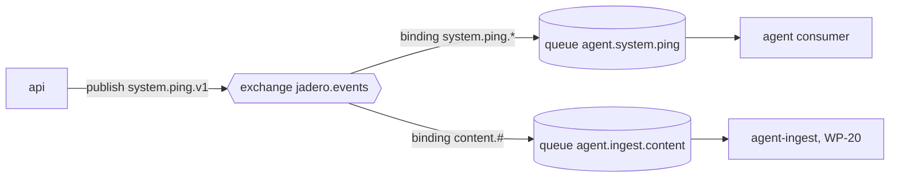
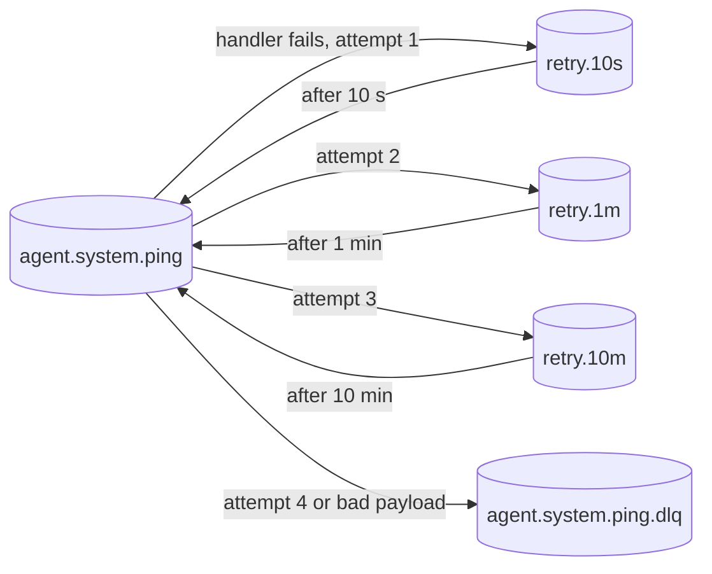

# WP-5: Messaging foundation and agent skeleton

Issue #13, branch `wp/5-messaging-foundation`, release R0, size M, tag learning. Depends on WP-3 (issue #11, closed).

Deliverable (report section 14): `packages/messaging` (the `MessageBus` port, RabbitMQ and in-memory adapters, CloudEvents envelope, outbox relay, inbox, retry and dead-letter topology), `infra/rabbitmq/definitions.json`, an AsyncAPI stub, the `apps/agent` skeleton; a `system.ping.v1` event travels `api` to RabbitMQ to `agent` with one trace.

What the owner learns (decisions.json): exchanges, bindings, queues, acks and prefetch; at-least-once delivery; the outbox and inbox patterns. This is the first WP where two processes talk, so most of the words go to what can fail between them: a crash between two writes, a message delivered twice, a message that never stops failing, a message that routes nowhere, a trace that breaks at the broker.

**Running in parallel with WP-4.** WP-4 (web skeleton) is being built at the same time on the owner's machine. Both touch `pnpm-workspace.yaml`, `pnpm-lock.yaml`, `.dependency-cruiser.cjs`, `AGENTS.md` and `docs/architecture/code-map.html`. Whichever merges second brings `main` in with a merge commit and regenerates the lockfile with `pnpm install`.

## How to read this file

Start with **Decisions explained**: the four decisions this WP implements, each as problem, example, decision, alternatives and patterns. Then **Implementation choices**, one line each. Everything after that is reference: the concepts in depth (C1 to C14), the traces, and the option blocks that were answered on 2026-10-04 (the file was written before the explainer format changed, see PR #82).

## Decisions explained

### D1. Why asynchronous messages and not an HTTP call between services?

**Problem.** When a project is published in `api`, the chat in `agent` must learn about it. If `api` calls `agent` directly, the two services are tied together.

**Example.** `api` sends `POST http://agent/index` while `agent` is restarting. The publish either fails or hangs until a timeout, and the owner sees an error for something that worked. If `agent` is slow, every publish is slow.

**Decision (ADR-029).** `api` leaves a message on RabbitMQ and carries on. Each consumer has its own durable queue; if `agent` is down, the message waits and is processed when it is back. `api` does not know who listens (publish-subscribe), so a new consumer joins later without touching `api`.



**Alternatives.**
- *Synchronous HTTP.* Discarded: one service down breaks the other (the distributed monolith). Wins when the caller needs the answer now, like checking a payment or a login.
- *Redis pub/sub or core NATS.* Discarded: a consumer that is not connected loses the message; retries and dead letters are your code. Wins for live notifications where losing one is fine (a "someone is typing" signal).
- *Kafka or Redpanda.* Discarded: about 1 GB of memory for a few events a day. Wins with high volume or when consumers must re-read history from the start.

**Patterns:** publish-subscribe, topic routing, competing consumers, distributed monolith (anti-pattern).

### D2. Why a transactional outbox and not publishing right after saving?

**Problem.** Saving to Postgres and publishing to RabbitMQ are two writes into two systems, and there is no transaction that covers both (the dual-write problem).

**Example.** `api` commits revision 7 of a project, then the process is killed before it publishes. The chat never learns about revision 7, and nothing retries. A try/catch does not help: a killed process runs no catch block.

**Decision (ADR-012).** The event is saved as a row in an `outbox` table **in the same transaction** as the revision: both or neither. A separate process (`api-worker`, the relay) reads unsent rows, publishes them, waits for the broker's confirm, and marks them sent. Bonus: when RabbitMQ is down, `api` keeps working and events wait in the table.

```mermaid
sequenceDiagram
  participant API as api
  participant DB as Postgres (content)
  participant W as api-worker (relay)
  participant MQ as RabbitMQ
  API->>DB: BEGIN; save revision 7; INSERT outbox row; COMMIT
  loop every 1 s
    W->>DB: claim unsent rows (FOR UPDATE SKIP LOCKED)
    W->>MQ: publish
    MQ-->>W: confirm
    W->>DB: mark sent; COMMIT
  end
```

**Alternatives.**
- *Publish after commit, in the request.* Discarded: a crash in between loses the event, and a broker outage fails user requests. Wins when losing an occasional event is acceptable (analytics counters).
- *A job queue inside Postgres (pg-boss).* Discarded: producer and consumers would share one database, which breaks "each service owns its database". Wins inside a single service (a monolith's background jobs).
- *Change data capture (Debezium reads the database log).* Discarded: a JVM service and more infrastructure for one small server. Wins in a large platform with many producers and a team to run it.

**Patterns:** dual-write problem, transactional outbox, message relay, publisher confirms, atomic claim.

### D3. Why at-least-once delivery with an inbox, and not exactly once?

**Problem.** Between two commits there is always a gap. The relay publishes, RabbitMQ confirms, and the relay dies before marking the row sent: on restart it publishes again. The same gap exists on the consumer side, between its commit and its ack.

**Example.** The message says "send the owner a contact mail" (WP-11). Delivered twice without protection, the owner gets two mails.

**Decision (ADR-012).** Duplicates are accepted as a fact and caught by the consumer. It records the event id in an `inbox` table **in the same transaction** as its work, with a unique key. On the second delivery the insert finds the id, so the consumer skips the work, acks and stops. Result: at-least-once delivery, exactly-once effects.

**Alternatives.**
- *"Exactly once" from the broker.* Discarded: between a broker and a database it does not exist; the gap between two commits is always there. Wins only inside one system that owns both sides (Kafka transactions between Kafka topics).
- *At-most-once (ack on receipt, before the work).* Discarded: a crash during the work loses the message. Wins for data that is useless when late (live metrics).
- *Handlers that are idempotent by nature (an upsert by revision number).* Kept as a second line of defense, not a replacement: "send a mail" cannot be written that way. Wins when every handler is a pure state overwrite.

**Patterns:** at-least-once delivery, idempotent consumer (inbox), exactly-once effects.

### D4. Why retries with growing delays and a dead-letter queue?

**Problem.** A handler fails. Sometimes it is temporary (the database restarts for 30 seconds), sometimes permanent (a bug, a payload that does not parse). Putting the message straight back makes both worse.

**Example.** `agent`'s database is down for 30 s. Requeued at once, the message fails thousands of times a minute and floods the logs. On RabbitMQ 4.3 with the library's defaults nothing stops that loop, because a `nack` does not count toward the delivery limit.

**Decision (ADR-029).** Retry after 10 s, then 1 min, then 10 min, using wait queues with a TTL and no consumer (the TTL is the timer). Each retry goes back only to the queue that failed. After the last attempt the message goes to a dead-letter queue (DLQ), where a person looks at it (WP-50). A payload that does not parse goes to the DLQ at once: retrying cannot fix it.



**Alternatives.**
- *Requeue at once.* Discarded: a hot loop on anything longer than a blip. Wins for failures that last milliseconds (a lock conflict), usually as a quick in-process retry.
- *One fixed delay.* Discarded: too short for a long outage or too long for a short one. Wins when every failure has the same shape.
- *The delayed message plugin.* Discarded: its own README warns of serious limitations, and it is built on a store RabbitMQ 4.3 removed. Wins on older RabbitMQ when per-message delays are needed.

**Patterns:** retry with backoff, dead-letter queue, poison message.

## Implementation choices

What WP-5 builds, from the answers recorded under Decision. Object to any line.

- Handlers return `done`, `retry` or `dead`; one adapter does the ack, the retry routing and the dead-lettering, so no handler can fall into the hot loop.
- The topology (exchange, queues, wait queues, DLQs, users) is a TypeScript module that generates `infra/rabbitmq/definitions.json`; services cannot create or delete queues.
- An alternate exchange keeps unroutable messages in `jadero.unrouted` instead of losing them silently.
- Outbox and inbox use `pg` behind a small `SqlExecutor` seam until Drizzle arrives in WP-10.
- The relay polls every second: a few events a day, one second of delay is invisible.
- The inbox key is `(consumer, event_id)`, so two consumers in one database never block each other.
- The relay restores the request's trace context, so one trace runs from the HTTP request to the consumer.
- `api-worker` and `agent`'s consumer are their own processes; a heartbeat every 5 minutes plus `POST /dev/ping` in development.

## Named here

| Name | What it is, in one line | When |
|---|---|---|
| WP-3 | Service platform: `platform-nest` (config, logging, problem+json, health, OpenTelemetry) and the `api` skeleton | done (PR merged) |
| WP-4 | Web skeleton (`apps/web`, Next.js) | in progress in parallel |
| WP-5 | This WP | now |
| WP-6 | CI pipeline: GitHub Actions with Postgres and RabbitMQ service containers, coverage gates, contract tests | R0, after WP-4 and WP-5 |
| WP-7 to WP-9 | Images, per-service release, server and deploy to new.jadero.dev (staging and the vhost `/staging` live there) | R0 |
| WP-10 | Data layer: Drizzle, migrations, repositories per service | R1, next backend candidate |
| WP-11 | Contact service: the second real producer and consumer (mail through the outbox) | R1 |
| WP-14 | Content events: `content.published.v1` and friends through the outbox from `api-worker` | R1 |
| WP-20 | Agent read model and ingestion: `agent-ingest` consumes content events | R2 |
| WP-26 | Observability across services: the hosted trace backend, queue depth and dead-letter alerts | R1 (after WP-23) |
| WP-50 | Event operations: dead-letter archive table, admin Events page, Replay action | R1 |
| ADR-003 | Inside a service: hexagonal modules where there are rules, layered where trivial; ports are abstract classes | accepted |
| ADR-005 | Drizzle is the data access library; repositories wrap it | accepted, lands in WP-10 |
| ADR-009 | Testing strategy: contract suites for adapters, Testcontainers for SQL and the broker, coverage gates | accepted |
| ADR-010 | Observability: OTLP traces, `traceparent` through HTTP and RabbitMQ headers, the outbox stores the request's `traceparent`; `/health/ready` covers "database and broker" | accepted |
| ADR-012 | Async work: transactional outbox per producer, relay with publisher confirms, inbox in the consumer's transaction; `api-worker` relays for `api` | accepted |
| ADR-029 | Service boundaries and messaging: RabbitMQ 4, topic exchange `jadero.events`, quorum queues, DLX per queue, retry tiers 10 s / 1 min / 10 min, prefetch 10, `definitions.json` as source of truth, `@golevelup/nestjs-rabbitmq` behind our `MessageBus` port, CloudEvents 1.0, Zod contracts, AsyncAPI 3 | accepted |
| ADR-042 | NestJS 12 on Node 24 LTS | accepted |
| ADR-043 | Own config loader before Nest (`loadConfig`), secrets rules | accepted |
| RabbitMQ | The AMQP 0.9.1 message broker, 4.3.6 in compose | infra |
| `@golevelup/nestjs-rabbitmq` | Nest module over `amqplib` + `amqp-connection-manager`: topic exchanges, routing keys, subscribe handlers | adapter in step 4 |
| `amqplib` | The Node AMQP 0.9.1 client everything above sits on | transitive |
| `@opentelemetry/instrumentation-amqplib` | Patches `amqplib` so publish injects `traceparent` into headers and consume continues the trace | step 6 |
| Testcontainers | Starts real Postgres and RabbitMQ containers for integration tests (`pnpm test:int`, needs Docker) | WP-3 harness, extended |
| CloudEvents 1.0 | CNCF spec for event metadata (`id`, `source`, `type`, `time`, ...) | step 2 |
| AsyncAPI 3 | The OpenAPI equivalent for message channels: a catalog of events | step 7 |
| Drizzle | TypeScript SQL query builder chosen by ADR-005 | WP-10 |

## Facts checked

| Tool | Version on 2026-10-04 | Source | Note |
|---|---|---|---|
| `@golevelup/nestjs-rabbitmq` | 9.1.0 (2026-09-28) | npm registry | peer `@nestjs/core ^11.1.24 \|\| ^12.0.0`; depends on `amqplib ^0.10.9` and `amqp-connection-manager ^5.0.0`; CommonJS. WP-3 spike row 3: go |
| `amqplib` | 2.2.0 (2026-09-28) | npm registry | golevelup still pins the 0.10 line, so we get 0.10.x transitively |
| `amqp-connection-manager` | 5.0.0 (2025-09-29) | npm registry, `dist/cjs/ChannelWrapper.js` | confirm channels on by default; while disconnected it buffers publishes in memory and has no publish timeout unless one is passed |
| `@opentelemetry/instrumentation-amqplib` | 0.69.0 (2026-08-31) | npm registry, `build/src/amqplib.js` | patches `amqplib >=0.5.5 <3`; consume continues the producer's trace by default, `useLinksForConsume` switches to span links |
| `@testcontainers/rabbitmq` | 12.2.0 (2026-09-28) | npm registry | same line as the WP-3 harness |
| `@asyncapi/parser` | 3.6.3 (2026-08-08) | npm registry | validates an AsyncAPI 3 document in a unit test |
| `cloudevents` (SDK) | 10.0.0 (2025-06-10) | npm registry | not needed: the envelope is a 10-line Zod schema |
| `zod` | 4.6.5 (catalog) | ran `z.toJSONSchema` locally | native JSON Schema output, used to put the schemas into AsyncAPI |
| RabbitMQ image | `4.3.6-management-alpine` (2026-09-29) | Docker Hub | already in `compose.dev.yml` |
| RabbitMQ quorum queues | 4.3 docs | rabbitmq-website `docs/quorum-queues` | delivery limit defaults to 20 since 4.0; since 4.3 it counts `basic.reject` and crashes, **not** `basic.nack`; dead-lettering is at-most-once unless `dead-letter-strategy: at-least-once` with `overflow: reject-publish`; queue and per-message TTL supported |
| RabbitMQ confirms | docs `confirms` | rabbitmq-website | an unroutable message is still confirmed (`basic.ack`); only with `mandatory` does the client also get a `basic.return` |
| RabbitMQ delayed message plugin | README | rabbitmq-delayed-message-exchange | its own README warns of "serious limitations", single-node, built on the Mnesia store removed in 4.3 |
| golevelup error behavior | 9.1.0 `lib/amqp/errorBehaviors.js` | package source | default `REQUEUE` calls `channel.nack(msg, false, true)` |
| PostgreSQL `uuidv7()` | 18 | `doc/src/sgml/func.sgml` on `REL_18_STABLE` | time-ordered UUIDs generated in SQL |
| CloudEvents distributed tracing extension | spec main | cloudevents/spec | `traceparent` and `tracestate` as event attributes; "not intended to replace the protocol specific headers" |

## First principles

### C1. Exchanges, bindings, queues

Tier: Own.

In RabbitMQ a producer never writes to a queue. It publishes a message to an *exchange* with a *routing key* (a string like `system.ping.v1`). A *binding* is a rule "queue Q wants messages from exchange X whose key matches pattern P". A *topic* exchange matches dotted keys with wildcards: `*` is exactly one word, `#` is zero or more, so `content.#` catches `content.published.v1` and `content.withdrawn.v1`, and `system.ping.*` catches every version of the ping. A *queue* is where messages wait for a consumer; it is the unit of buffering, ordering and acknowledgement. The consequence that shapes everything: the producer does not know who listens. `api` publishes `system.ping.v1` to `jadero.events`; whether zero, one or five queues receive a copy depends only on bindings. That is publish-subscribe, and it is what lets a new consumer appear later (WP-20) without touching `api`. Each consumer gets its own queue (one per consumer and purpose, ADR-029), so two services each receive their own copy; two instances of the *same* consumer reading one queue share the work instead (competing consumers).

### C2. Durable, persistent, quorum

Tier: Own.

Three separate things keep a message alive across a broker restart: the queue must be durable, the message must be published as persistent (`delivery_mode: 2`), and the queue type decides how it is stored. A *quorum queue* replicates through Raft and writes to disk before confirming; on one node it is simply a durable, disk-backed queue with extra features we want: a delivery limit against poison messages and at-least-once dead-lettering. A *classic* queue is lighter but has neither. ADR-029 chose quorum queues for every consumer queue.

### C3. Unroutable messages

Tier: Own.

If no binding matches, the exchange drops the message, and with publisher confirms on, the broker still answers `basic.ack` (RabbitMQ docs, "When will published messages be confirmed"). So a typo in a routing key, or a consumer queue that does not exist yet, loses events while the relay believes they were delivered. Two defenses: publish with `mandatory: true`, which makes the broker send a `basic.return` before the ack so the relay can tell; or give the exchange an *alternate exchange*, which receives everything nobody else wanted, bound to a queue `jadero.unrouted` that we can watch. The alternate exchange works for every publisher without code; `mandatory` needs return handling in the client.

### C4. Acknowledgements and prefetch

Tier: Own.

A consumer gets a delivery and must later say what happened: `ack` (done, delete it), `nack` or `reject` with `requeue=true` (put it back at the head of the queue, usually redelivered at once), or with `requeue=false` (drop it, or dead-letter it if the queue has a dead-letter exchange). Until it answers, the message is *unacknowledged*: invisible to others and redelivered if the consumer's connection dies. *Prefetch* (QoS) caps how many unacknowledged messages one consumer may hold; ADR-029 sets 10. Low prefetch spreads work and limits what is redelivered after a crash; high prefetch hides network latency. The key point for design: the ack is the commit point of the consumer. Ack too early and a crash loses the message; ack after the effects commit and a crash means the message comes again. There is no third option, which is why the next concept exists.

### C5. At-least-once delivery and the idempotent consumer

Tier: Own.

Between a consumer committing its database transaction and RabbitMQ receiving the ack there is a gap. If the process dies in that gap, the broker redelivers a message whose effects are already committed. The same happens on the producer side (Trace 1, step 3). So every message may arrive more than once: *at-least-once delivery*. "Exactly once" between a broker and a database is not available; what we can build is *exactly-once effects*: the consumer records the event id in an `inbox` table in the same transaction as its effects, with a unique key. The second delivery's insert hits the key, the consumer knows the work is done, acks and stops. The inbox only works if the insert and the effects share one transaction; an inbox row written in a separate transaction brings the gap back. Some effects are idempotent by nature (an upsert of "revision 7 of project X" that ignores older revisions), and that is a second line of defense, not a replacement: not every handler can be written that way.

### C6. Ordering

Tier: Own.

One queue with one consumer and prefetch 1 delivers in order. Retries, prefetch above 1, more consumers, and the relay's batches all break that. We do not promise order. Consumers that care compare a version carried in the event (the content revision in WP-14) and ignore older ones. The ping does not care.

### C7. The dual-write problem and the transactional outbox

Tier: Own.

A use case that writes its database and then publishes to the broker does two writes into two systems with no shared transaction. Crash after the commit and before the publish: the state changed and nobody hears about it. Publish first and the commit fails: everyone hears about something that never happened. A try/catch with rollback does not help, because the broker publish cannot be rolled back and the crash may be a killed process (this was the owner's D-12 question). The *transactional outbox* turns two writes into one: the use case inserts the event as a row in an `outbox` table in the same database transaction as the state change. Either both commit or neither does. A separate *relay* later reads the row, publishes it, and marks it sent. The broker leaves the request path entirely: `api` keeps accepting writes while RabbitMQ is down, and the relay catches up (report section 3.5).

### C8. The relay and the atomic claim

Tier: Own.

The relay is a loop: find unsent rows, publish each, wait for the broker's *publisher confirm* (the broker's "I have it, on disk"), mark the row sent. Two relays (or two loop iterations that overlap) must not publish the same row at once. `SELECT ... FOR UPDATE SKIP LOCKED` locks the rows it reads and makes a concurrent reader skip them instead of waiting: an atomic claim. The lock lives until the transaction ends, so the relay keeps the transaction open while it publishes the batch, then marks and commits. If it dies after the confirm and before the commit, the rows unlock unmarked and get published again: at-least-once, handled by the inbox. If RabbitMQ is down, the publish never confirms; the relay must give up after a timeout, record the attempt and back off, or it hangs forever (`amqp-connection-manager` has no publish timeout by default, Facts checked). How the relay learns there is work is a choice (option block L): poll on a timer, or let Postgres wake it with `LISTEN/NOTIFY`.

### C9. Retries, dead letters and poison messages

Tier: Own.

A handler can fail for two kinds of reasons: *transient* (database blip, provider timeout: try later) and *permanent* (the payload does not parse, a bug: trying again changes nothing). Requeueing at once turns a transient failure into a hot loop that burns CPU and logs; a permanent failure requeued forever is a *poison message* that blocks nothing in theory but floods everything in practice. RabbitMQ's tools: a *dead-letter exchange* (DLX) per queue receives messages that are rejected without requeue, expire by TTL, or exceed the delivery limit; a *TTL* on a queue makes messages expire after a fixed time. Combined, they give delayed retry without any timer in our code: put the message in a "wait 10 s" queue that has no consumer, a TTL of 10 s, and a DLX that sends it back to the work queue. Three such queues give ADR-029's tiers (10 s, 1 min, 10 min); after the last, the message goes to the *dead-letter queue* (DLQ), where a human (WP-50) decides. Two traps verified for RabbitMQ 4.3: (1) the quorum delivery limit of 20 counts `basic.reject` and consumer crashes, but **not** `basic.nack`, and golevelup's default error behavior is `nack` with requeue, so a failing handler on defaults loops forever and the delivery limit never fires; (2) dead-lettering out of a quorum queue is *at-most-once* by default (a message can be lost in transfer), unless the queue sets `dead-letter-strategy: at-least-once` and `overflow: reject-publish`. A third trap, structural: a wait queue that dead-letters back to `jadero.events` with the original routing key re-publishes to *every* bound queue, so one consumer's retry becomes a duplicate for all the others. A retry must return to the one queue that failed (option block R).

### C10. The CloudEvents envelope

Tier: Recognize, with one Own part.

CloudEvents 1.0 is a standard set of metadata around an event: `specversion`, `id` (unique per event, our idempotency key), `source` (who emitted it, `jadero/api`), `type` (what happened, `dev.jadero.system.ping.v1`, versioned), `time`, `datacontenttype`, and `data` (the payload). Extensions add attributes; the distributed tracing extension adds `traceparent`. On AMQP there are two *content modes*: *structured* (the whole envelope is the JSON body, content type `application/cloudevents+json`) and *binary* (metadata goes into AMQP headers prefixed `cloudEvents:`, the body is just `data`). The Own part is versioning: a consumer may be older or newer than the producer, so a type's schema only gains optional fields (expand), and a breaking change is a new type `...v2` published next to `v1` until every consumer moved (contract). The routing key is the type without the reverse-DNS prefix: `system.ping.v1`. Schemas live in `packages/contracts` as Zod, and a contract test has every consumer parse the producer's example fixture.

### C11. One trace across an asynchronous hop

Tier: Own.

A trace is a tree of spans joined by a trace id; context crosses a process boundary in the W3C `traceparent` string (`00-<trace id>-<parent span id>-<flags>`). Over HTTP the OTel instrumentation puts it in a header. Over RabbitMQ, `instrumentation-amqplib` injects it into the message headers at publish and continues the trace at consume. The outbox breaks this chain unless we act: the relay publishes seconds later, from another process (`api-worker`), inside its own poll loop, so the context active at publish time is the relay's, not the request's. ADR-010 says the outbox row stores the request's `traceparent`; the relay must make that the active context (as parent or as a link) before it publishes, and then the amqplib instrumentation carries it on. A second consideration is privacy: spans and log lines carry ids and types, never the event body.

### C12. Ports and adapters for a broker

Tier: Own.

ADR-003's rule: the application depends on an abstract class (the port), and an adapter in `infrastructure/` implements it. For messaging the port answers "publish this envelope" and "deliver envelopes of this type to this handler", and the handler returns an outcome (done, retry later, dead) instead of calling `ack` itself. What this buys: use cases and handlers are tested with the in-memory adapter, no broker; a contract suite proves the in-memory and RabbitMQ adapters behave alike; the retry and dead-letter policy lives in one adapter, not in every handler. What it costs: one more layer, and some broker features (headers, priorities) stay out unless the port names them. The owner's D-41 doubt ("an adapter would allow swapping RabbitMQ; unsure it is worth it beyond learning") is fair: the main payoff is testability and one place for the failure policy, not swapping brokers.

### C13. Process types

Tier: Own.

One codebase and one image per service, started with different commands (report section 3.2). `api` serves HTTP; `api-worker` runs the relay (and later the PDF CV and revalidation). Background work gets its own process, memory limit and restart policy, so a stuck relay cannot slow a request, and an HTTP crash does not stop event delivery. It is not a new service: same database, same code, same deploy. The same applies to `agent` (HTTP chat) and `agent-ingest` (event consumer, WP-20).

### C14. Readiness with a broker

Tier: Own.

From WP-3: liveness asks "restart me?", readiness asks "send me work?". Thanks to the outbox, `api` does not need the broker to do its job, so the broker does not belong in `api`'s readiness (if it did, a broker outage would take the site's API out of rotation for no reason). `api-worker` cannot do its job without both Postgres and RabbitMQ, so its readiness checks both. A consumer process likewise. A process with no HTTP server still needs a way to answer the probe (a small health server on its own port is the simplest).

## One concrete trace

The trace uses the shapes the questions propose as defaults; where an answer changes a step, the step says so. Values are realistic and consistent: trace id `4bf92f3577b34da6a3ce929d0e0e4736`, event id `0199b1c4-7e2a-7c3d-9f10-3a5b7c9d1e2f` (a UUIDv7: the first 48 bits are the time).

### Trace 1: a ping crosses the broker, and arrives twice

1. **Trigger** (depends on Q8). `curl -X POST http://127.0.0.1:3001/dev/ping` on `api` in development. The HTTP instrumentation opens span `POST /dev/ping`, span id `00f067aa0ba902b7`.
2. **Outbox write.** The `SendPing` use case builds the envelope with `traceparent` = the current context and inserts it in one transaction (here the ping changes no other state; in WP-14 the content update joins the same transaction):

   ```sql
   BEGIN;
   INSERT INTO messaging.outbox (id, type, routing_key, envelope, created_at)
   VALUES ('0199b1c4-7e2a-7c3d-9f10-3a5b7c9d1e2f', 'dev.jadero.system.ping.v1', 'system.ping.v1', $1, now());
   COMMIT;
   ```

   with `$1`:

   ```json
   {"specversion":"1.0","id":"0199b1c4-7e2a-7c3d-9f10-3a5b7c9d1e2f","source":"jadero/api","type":"dev.jadero.system.ping.v1","time":"2026-10-04T10:15:02.114Z","datacontenttype":"application/json","traceparent":"00-4bf92f3577b34da6a3ce929d0e0e4736-00f067aa0ba902b7-01","data":{"trigger":"manual"}}
   ```

   `api` answers `202 {"eventId":"0199b1c4-..."}` in about 5 ms. RabbitMQ has not been touched. The `pg` instrumentation adds an `INSERT` span under `POST /dev/ping`.
3. **Relay** in `api-worker` (depends on Q5; here: poll every 1 s, batch 50):

   ```sql
   BEGIN;
   SELECT id, routing_key, envelope FROM messaging.outbox
    WHERE published_at IS NULL AND next_attempt_at <= now()
    ORDER BY created_at LIMIT 50 FOR UPDATE SKIP LOCKED;
   -- for each row: restore the stored traceparent as context, publish, await confirm (timeout 5 s)
   UPDATE messaging.outbox SET published_at = now() WHERE id = ANY($1);
   COMMIT;
   ```

   The publish: exchange `jadero.events`, routing key `system.ping.v1`, properties `content_type: application/cloudevents+json`, `message_id: 0199b1c4-...`, `delivery_mode: 2`, header `traceparent: 00-4bf9...4736-<publish span id>-01` (injected by `instrumentation-amqplib` because the stored context was made active, Q7). The broker confirms once the quorum queue has written the message.
4. **Routing.** `jadero.events` (topic) matches the binding `system.ping.*` of queue `agent.system.ping` (quorum, DLX `jadero.dlx`, `dead-letter-strategy: at-least-once`, `overflow: reject-publish`). Had nothing matched, the alternate exchange would put it in `jadero.unrouted` (Q2).
5. **Consume** in `agent`'s consumer process (prefetch 10). `instrumentation-amqplib` reads `traceparent` and opens span `agent.system.ping process` in the same trace. The adapter parses the body with `cloudEventEnvelope` and then `systemPingV1Data` from `@jadero/contracts`. The handler runs in one transaction:

   ```sql
   BEGIN;
   INSERT INTO messaging.inbox (consumer, event_id, type, received_at)
   VALUES ('agent.system.ping', '0199b1c4-7e2a-7c3d-9f10-3a5b7c9d1e2f', 'dev.jadero.system.ping.v1', now())
   ON CONFLICT DO NOTHING RETURNING event_id;   -- 1 row: first time
   INSERT INTO broker_heartbeat (source, last_event_id, last_seen_at) VALUES ('jadero/api', $1, now())
   ON CONFLICT (source) DO UPDATE SET last_event_id = EXCLUDED.last_event_id, last_seen_at = EXCLUDED.last_seen_at;
   COMMIT;
   ```

   Then the adapter acks. Log line (no body): `{"level":30,"service":"agent","msg":"event handled","consumer":"agent.system.ping","type":"dev.jadero.system.ping.v1","event_id":"0199b1c4-...","attempt":1,"duration_ms":6,"trace_id":"4bf92f3577b34da6a3ce929d0e0e4736"}`.
6. **What the trace shows** (console exporter in dev): `POST /dev/ping` (api) > `INSERT messaging.outbox` (api) > `system.ping.v1 publish` (api-worker) > `agent.system.ping process` (agent) > two `INSERT` spans (agent). One trace id across three processes, with a gap of up to 1 s (the poll) between the insert and the publish, which is the outbox's latency made visible.
7. **The same event again.** Suppose `api-worker` was killed after the confirm and before `COMMIT`. The row unlocks with `published_at` still null, the next tick publishes it again with the same `id`. In `agent` the inbox insert returns **0 rows**: the handler skips the effects, commits, acks, and logs at `debug` `"duplicate ignored"`. The heartbeat row is unchanged. This is at-least-once delivery with exactly-once effects.

### Trace 2: two failures

#### Trace 2a: the consumer's database is down

1. `agent`'s Postgres stops. A ping arrives; the inbox `INSERT` fails with `ECONNREFUSED 127.0.0.1:5432`. The transaction never started, nothing was written.
2. The handler throws; the adapter classifies it as transient (any error that is not a schema failure) and, with Q3's default, publishes a copy to queue `agent.system.ping.retry.10s` through the default exchange with header `x-jadero-attempt: 2`, waits for the confirm, then acks the original. Log at `warn`: `"event retry scheduled"`, `attempt: 1`, `delay_ms: 10000`, the error class and message, no body.
3. `agent.system.ping.retry.10s` has no consumer, `x-message-ttl: 10000`, and dead-letters to the default exchange with routing key `agent.system.ping`. After 10 s the message is back in the work queue, and only there: the other queues bound to `jadero.events` never see it.
4. Attempt 2 fails: the copy goes to `.retry.1m`. Attempt 3 fails: `.retry.10m`. Total waiting before attempt 4: 10 s + 60 s + 600 s = 11 min 10 s.
5. Attempt 4 fails: the adapter `reject`s without requeue; the queue's DLX `jadero.dlx` routes it to `agent.system.ping.dlq`. Log at `error`. From WP-26 an alert fires on a non-empty DLQ; from WP-50 the message is archived to a `dead_letters` table and can be replayed.
6. A payload that does not parse (a producer bug) skips the tiers: retrying cannot fix it, so it goes straight to the DLQ on attempt 1.
7. The counterexample, what the defaults would do: golevelup's `REQUEUE` behavior calls `nack(requeue=true)`; the message returns to the head of the queue and is redelivered within milliseconds, thousands of times a minute, and on RabbitMQ 4.3 a `nack` does not count toward the delivery limit of 20, so nothing stops it.

#### Trace 2b: the broker is down

1. `docker compose stop rabbitmq`. `api` still answers `POST /dev/ping` with 202: the outbox insert does not need the broker. `api`'s `/health/ready` stays 200.
2. The relay claims the row, publishes; `amqp-connection-manager` buffers it in memory and the confirm never comes. After 5 s the relay's timeout fires, it records `attempts = attempts + 1`, `last_error = 'publish timeout'`, `next_attempt_at = now() + backoff` (1 s, 2 s, 4 s, capped at 60 s), commits, and logs at `warn`. `api-worker`'s `/health/ready` turns 503 with `{"broker":{"status":"down","message":"unavailable"}}`.
3. Rows pile up in `messaging.outbox` (`SELECT count(*) FROM messaging.outbox WHERE published_at IS NULL` shows them). Nothing is lost.
4. `docker compose start rabbitmq`. The connection manager reconnects. The buffered publish from step 2 may now be confirmed as well; the row is claimed again on the next tick and published a second time. The consumer's inbox absorbs the duplicate. Readiness returns to 200.

## Patterns

| Pattern | Where it appears |
|---|---|
| Publish-subscribe, topic routing | Trace 1, step 4: `jadero.events`, binding `system.ping.*` |
| Competing consumers | Two `agent` consumer instances reading `agent.system.ping` (not in WP-5, possible later) |
| Transactional outbox | Trace 1, step 2 |
| Message relay, publisher confirms | Trace 1, step 3 |
| Atomic claim (`FOR UPDATE SKIP LOCKED`) | Trace 1, step 3 |
| At-least-once delivery | Trace 1, step 7; Trace 2b, step 4 |
| Idempotent consumer (inbox) | Trace 1, steps 5 and 7 |
| Retry with backoff (delayed retry via TTL and DLX) | Trace 2a, steps 2 to 4; the relay's backoff in Trace 2b, step 2 |
| Dead-letter queue, poison message | Trace 2a, steps 5 to 7 |
| Alternate exchange | Trace 1, step 4 |
| Event envelope (CloudEvents), versioned event types, expand/contract | Trace 1, step 2 |
| Trace context propagation | Trace 1, steps 3, 5, 6 |
| Ports and adapters, contract test suite | The `MessageBus` port, in-memory and RabbitMQ adapters (option block P) |
| Process types | `api` and `api-worker`, `agent` HTTP and its consumer (option block W) |
| Infrastructure as code | `infra/rabbitmq/definitions.json` (option block T) |
| Synthetic heartbeat | The ping as a periodic end-to-end check (option block W) |

## Options and trade-offs

### P. Port shape

Already decided by ADR-029: golevelup behind our port, an in-memory adapter for unit tests.

Forces: handlers should be testable without a broker; the retry and dead-letter policy should live in one place; the port should not grow a copy of the whole AMQP API; less code is less to maintain.

- *P1. Thin port with outcome-returning handlers.* `MessageBus.publish(envelope)` and `MessageBus.subscribe(consumer, handler)`, where the handler receives a parsed envelope and returns `done`, `retry` or `dead` (a thrown error counts as `retry`, a schema failure as `dead`). The adapter owns ack, nack, retry routing and logging. Matches the ADR. Pros: handlers know nothing about AMQP; one contract suite runs against both adapters; the retry policy is written once. Cons: more code in `packages/messaging` (a registry of subscriptions, the outcome mapping); golevelup's decorators are not used. Wins when several services consume, which is the plan (agent, api-worker, contact).
- *P2. Port for publishing only; consumers use golevelup's `@RabbitSubscribe` directly in `presentation/`.* Pros: least code, golevelup's documented path. Cons: every handler chooses its own error behavior (and the default is the hot loop, Trace 2 step 7); unit tests of handlers need a fake for golevelup's types; the in-memory adapter covers half the story. Partly departs from the ADR's "behind our port" for consumers. Wins for a single consumer that will never grow.
- *P3. Nest microservices transport (`@EventPattern` with `Transport.RMQ`)* (not recommended). Pros: built into Nest. Cons: only the default exchange and a fixed `pattern`/`data` body, so no topic exchange and no CloudEvents (ADR-029 rejects it explicitly). Would need a superseding ADR. Wins only for request-reply between Nest apps, which this project forbids between services.
- *P4. Thin port (as P1) over our own `amqplib` adapter, no golevelup.* Pros: full control (timeouts, `reject` vs `nack`, startup that does not block); one less dependency, and golevelup pins the old `amqplib` 0.10 line. Cons: reconnection, channel recovery and confirm tracking become our code, about 200 lines that golevelup and `amqp-connection-manager` already handle. ADR-029 names it as the fallback, so choosing it now means a superseding ADR. Wins if golevelup's blocking `init` or its error handling fights the port.

What would make this wrong: if handlers keep needing AMQP details the port does not expose (priorities, per-message TTL, headers beyond trace context), the port is in the way; if only one consumer ever exists, P1's extra code is waste.

### T. Who declares the topology

Already decided by ADR-029: `infra/rabbitmq/definitions.json` is the reviewed source of truth; vhosts `/prod` and `/staging`, one user per service and vhost, each allowed only its own queues.

Forces: one reviewed place for the topology; least privilege (a service user that can *configure* can also delete or redeclare); a mismatch between what code asserts and what exists breaks the channel (`PRECONDITION_FAILED` when arguments differ); developers want `pnpm dev:up` to just work; definitions with real passwords are a secret.

- *T1. `definitions.json` only.* The broker loads it at boot (`load_definitions`); services get `read` and `write` but no `configure` permission, and use `checkQueue` / `checkExchange` (golevelup's `createQueueIfNotExists: false`), so a missing queue fails readiness loudly. Matches the ADR. Pros: one source of truth, least privilege, drift is impossible because code cannot create anything. Cons: adding a consumer touches two files (code and definitions); the in-compose file holds dev users with fixed dev passwords, and staging and production need their users created at deploy with real secrets (WP-8, WP-9), so the committed file is topology plus dev users only.
- *T2. Code declares its own topology at startup (golevelup's default `assert*`).* `definitions.json` only for vhosts and users. Pros: one file per change, the queue is declared next to its handler. Cons: services need `configure`; the topology is spread across services and only visible at run time; two services asserting the same exchange with different arguments break each other at boot. Departs from the ADR (superseding ADR). Wins in a team where each service owns its broker setup and there is no central review.
- *T3. Both: `definitions.json` plus code asserting the same objects* (not recommended). Pros: works even if definitions were not loaded. Cons: two sources of truth that must match argument for argument, and a mismatch is a channel error at boot; still needs `configure`. Wins nowhere this project can see.
- *T4. Generate `definitions.json` from a TypeScript topology module* (one source in code, a script writes the JSON, a test fails when they differ). Pros: typed, reusable by the adapter (it knows queue names and tiers) and by the AsyncAPI stub. Cons: a generator to maintain. Compatible with the ADR (the JSON is still the reviewed artifact).

Also in T, with a clear default: an alternate exchange `jadero.unrouted` on `jadero.events`, with a queue of the same name, so an unroutable event is kept and visible instead of confirmed and dropped.

What would make this wrong: frequent topology changes that make the two-file edit painful (T4 then pays off); or a broker you do not control (a managed service that forbids definitions import).

### R. Retry routing

Already decided by ADR-029: TTL retry queues of 10 s, 1 min and 10 min, then a DLQ per queue; ADR-012: every queue has a DLQ.

Forces: a retry must go back only to the queue that failed (Trace 2a, step 3); the tier must grow with the attempt; no message may be lost between queues; no hot loop; the topology should stay readable.

- *R1. Consumer-routed: the adapter publishes a copy to the right wait queue and acks the original.* Per consumer queue Q: `Q.retry.10s`, `Q.retry.1m`, `Q.retry.10m` (no consumers, `x-message-ttl`, DLX = default exchange with `x-dead-letter-routing-key: Q`), and `Q.dlq`. The adapter reads an attempt header, picks the tier, publishes with confirm, then acks. After the last tier it `reject`s without requeue into `jadero.dlx`, which routes to `Q.dlq`. Matches the ADR. Pros: exact tiers; retries never fan out; the attempt count is ours and visible. Cons: four extra queues per consumer (generated, T4 helps); a crash between the copy's confirm and the ack gives a duplicate, which the inbox absorbs.
- *R2. Broker-routed with dead-letter chains only (`reject` without requeue, DLX into a 10 s queue, back to Q).* Pros: no publish from the consumer. Cons: a DLX is fixed per queue, so the broker cannot pick a longer delay for a later attempt; you get one fixed delay unless you build a chain of queues per attempt; at-least-once dead-lettering needs the quorum settings above. Wins when one fixed delay is enough, which departs from the ADR's three tiers (superseding ADR).
- *R3. In-process retry first (a few quick attempts with backoff inside the handler, holding the message unacked), then R1.* Pros: a blip of 200 ms is absorbed without any broker round trip. Cons: holds a prefetch slot, so 10 slow retries stall the consumer; a crash during the wait redelivers anyway. Compatible with the ADR as an addition.
- *R4. The delayed message exchange plugin* (not recommended). Pros: one exchange, per-message delay. Cons: its own README warns of serious limitations, single node, built on the metadata store removed in RabbitMQ 4.3. Wins nowhere on 4.3.

What would make this wrong: if most failures turn out to be permanent (bugs), tiers only delay the DLQ by 11 minutes; if a consumer needs strict order, any retry that lets later messages pass breaks it.

### S. Outbox and inbox storage before WP-10

Already decided by ADR-012: outbox in each producer's database, inbox in each consumer's database, same transaction as the effects; ADR-005: Drizzle, repositories wrap it; WP-3 decision D1: `pg` is the driver.

Forces: the outbox insert must join the caller's transaction, so the store has to accept a transaction handle from outside; `packages/messaging` must not depend on Drizzle or on any service's schema; WP-10 will add Drizzle and must not need to rewrite messaging; DDL must reach each service's database.

- *S1. A store port in `packages/messaging` over a minimal `SqlExecutor` (`query(text, values)`), implemented now with `pg`; SQL migration files shipped by the package.* `OutboxStore.add(tx, envelope)` and `InboxStore.tryRecord(tx, consumer, eventId)` take the caller's executor; a `pg.PoolClient` already fits `SqlExecutor`, and in WP-10 a three-line adapter wraps Drizzle's transaction. The tables live in a `messaging` schema in each service database; `packages/messaging/sql/0001_messaging.sql` is applied by a small migrate script per service until drizzle-kit adopts it as a custom migration (**verify** at WP-10). Within the ADRs. Pros: the SQL is visible (the claim query is the lesson), no Drizzle in a shared package, WP-10 adds rather than rewrites. Cons: a temporary migrate script; raw SQL in one package.
- *S2. Pull Drizzle forward into WP-5* (the schema for outbox and inbox in Drizzle, drizzle-kit migrations). Pros: one data layer from day one. Cons: WP-10's decisions (schema layout, migration flow, repository shape) would be made inside a messaging WP without their explainer; `packages/messaging` would depend on Drizzle. Within ADR-005, but changes WP order.
- *S3. In-memory outbox and inbox only in WP-5; Postgres versions in WP-10 or WP-14* (not recommended). Pros: smallest WP-5. Cons: the deliverable says "outbox relay, inbox" and ADR-009 wants the outbox claim tested under concurrency against real Postgres; the ping would prove nothing about the dual-write problem. Wins only if WP-10 had to come first anyway.
- *S4. The outbox store owned by each service* (each app writes its own outbox SQL; the package ships only the relay loop). Pros: each service controls its tables. Cons: three copies of the same claim query to keep in sync. Wins if services' needs diverged, which nothing suggests.

What would make this wrong: if WP-10 picks a different driver than `pg` (it inherits D1, so unlikely), or if Drizzle's transaction object cannot expose a raw query (then the adapter in WP-10 is more than three lines).

### L. Relay trigger and claim

Already decided by ADR-012: claim with `FOR UPDATE SKIP LOCKED`, publish with confirms, mark sent; `api-worker` relays for `api`.

Forces: latency between commit and publish; load on Postgres when idle; behavior under a broker outage; simplicity.

- *L1. Poll every 1 s, batch 50, transaction held during the publish.* Pros: simplest, correct, the latency (up to 1 s) is invisible at this site's volume (a few events a day plus the ping). Cons: one cheap query per second per relay while idle (an index on unsent rows keeps it to microseconds).
- *L2. `LISTEN/NOTIFY` to wake the relay, plus a slow poll (every 30 s) as a safety net.* The insert path runs `NOTIFY messaging_outbox` (or a trigger does). Pros: latency in milliseconds, almost no idle load. Cons: notifications are lost while the relay is disconnected (hence the safety poll anyway); a dedicated connection that holds `LISTEN`; more moving parts. Wins when latency matters (a chat feature waiting on an event), which nothing here needs.
- *L3. Lease instead of a held lock: `UPDATE ... SET claimed_until = now() + interval '30 s' ... RETURNING`, commit, publish outside any transaction, then mark.* Pros: no transaction open during network I/O; works with many relays and slow publishes. Cons: one more column and a lease expiry to reason about. Wins with high volume or slow brokers.
- *L4. Change data capture (Debezium reading the write-ahead log)* (not recommended). Pros: no polling, no relay code. Cons: a JVM service and Kafka Connect or similar, far beyond one CX33; another component to fail. Wins in a large platform with many producers.

Also in L, with clear defaults: publish timeout 5 s; backoff per row 1 s doubling to 60 s; sent rows deleted by a daily cleanup after 7 days (ADR-012: outbox cleanup in each relay).

What would make this wrong: if a future feature needs sub-second propagation (L2), or volume grows to thousands of events a minute (L3).

### I. Inbox key and retention

Already decided by ADR-012: an `inbox` table of processed event ids in the consumer's transaction.

Forces: one service may have several consumers of the same event (e.g. in `agent`, ingestion and a usage counter); a duplicate can arrive late (a replay from the DLQ days later, WP-50); the table must not grow forever.

- *I1. Primary key `(consumer, event_id)`.* Each consumer records its own processing. Pros: two consumers in one database are independent; the row says who processed what. Cons: one row per consumer per event.
- *I2. Primary key `event_id` only.* Pros: smallest. Cons: the second consumer in the same database sees the first one's row and skips its work, silently. Wins only with exactly one consumer per database forever.
- *I3. No inbox; every handler is naturally idempotent* (not recommended). Pros: no table. Cons: every handler author must get idempotency right; "send a notification mail" (WP-11) is not naturally idempotent. Departs from ADR-012 (superseding ADR).

Retention, with a clear default: keep inbox rows 30 days, deleted by a daily cleanup; a replay older than that is a human decision in WP-50 anyway. What would make this wrong: a replay policy that resends events older than the retention window as routine.

### E. Envelope and the trace across the outbox

Already decided by ADR-029: CloudEvents 1.0 with `id`, `source`, versioned `type`, `time`, `traceparent`; ADR-010 decides: `traceparent` in RabbitMQ headers through `instrumentation-amqplib`, and the outbox stores the request's `traceparent`.

Forces: the id must be unique and cheap to index; consumers should parse one shape; the trace should be one tree in the backend; OTel's messaging conventions prefer links for batches.

- *E1. Structured mode (envelope as the JSON body), UUIDv7 ids, the relay restores the stored `traceparent` as the parent context before publishing.* The trace is one tree from the HTTP request to the consumer (Trace 1, step 6). Pros: the outbox row is exactly the message (what you see in the table is what goes on the wire, and what WP-50 replays); UUIDv7 indexes well and sorts by time; one tree is easy to read. Cons: the relay's own work (the poll) is not in that tree; a batch of 50 rows produces 50 publish spans each under a different trace, which is correct but means the relay has no single span for its batch.
- *E2. Same, but with a span link instead of a parent* (the relay's batch span links to each stored context; consumer spans link to the producer with `useLinksForConsume`). Pros: follows the OTel messaging conventions to the letter; the relay batch is one span. Cons: most backends show linked traces as separate traces you click between; "one trace" from the deliverable becomes "linked traces". Wins when a batch carries many events from different requests and you care about the relay's own timing.
- *E3. Binary mode (CloudEvents attributes as `cloudEvents:*` AMQP headers, body = `data` only).* Pros: brokers and tools can route or filter on headers without parsing JSON. Cons: two places to read an event; the outbox row and the wire message differ. Wins with header-based routing, which topic keys already cover.
- *E4. No context restore; the event id in logs joins the two halves* (not recommended). Pros: no code. Cons: two unrelated traces per event; contradicts ADR-010's "a trace runs browser to `agent-ingest` without gaps".

Id generation, with a clear default: UUIDv7 created in code, because the envelope must hold its id before the insert (the `uuid` package, 14.0.2). Postgres 18's `uuidv7()` would only fit if the database generated the id, and `crypto.randomUUID()` gives v4, which indexes worse because it is random. What would make this wrong: many events per request (batches) make E2 more honest than E1.

### W. Process types, readiness and the ping

Already decided by report section 3.2: `api` and `api-worker` process types; ADR-012: `api-worker` relays; WP-3 forward question: the broker in `api-worker`'s readiness, not `api`'s.

Forces: the deliverable needs `api` to `agent` with one trace; the skeleton should be the shape WP-11, WP-14 and WP-20 extend, not a shortcut they undo; the ping trigger must not become a public endpoint; a heartbeat would be useful later (the "Under the hood" page shows broker lag).

- *W1. Create the process types now: `apps/api/src/worker.ts` (`api-worker`: relay) and `apps/agent` with two entries, `main.ts` (HTTP, health) and `consumer.ts` (the ping consumer; becomes `agent-ingest` in WP-20); each worker has a small health server on its own port. Readiness: `api` = Postgres; `api-worker` = Postgres + broker; `agent` HTTP = Postgres; `agent` consumer = Postgres + broker.* Matches report 3.2 and ADR-012. Pros: the real shape from day one; failure isolation is demonstrable (stop `api-worker`, `api` keeps answering). Cons: four processes to run in dev (`pnpm dev` starts them all).
- *W2. Relay and consumer in-process for now (inside `api` and `agent`), split later.* Pros: two processes in dev. Cons: the broker joins `api`'s readiness or is silently unchecked; WP-14 has to move code. Departs from the process-type shape for a while, not from an ADR.
- *W3. A separate `worker` app that relays for every service* (not recommended). Pros: one process. Cons: it touches every service's database, which is the distributed monolith ADR-029 warns about. Departs from ADR-029.

The trigger, three options: (a) a heartbeat every 5 minutes from `api-worker` (writes the outbox row itself; `agent` records `last_seen_at`, a future lag signal for WP-26 and the Under the hood page); (b) `POST /dev/ping` on `api`, registered only when `NODE_ENV=development`; (c) both. A public trigger is out: anyone could fill the queues.

What would make this wrong: memory on the CX33 (each Node process is about 60 to 100 MB); if four processes do not fit with everything else, W2 for `agent` until WP-20 is the fallback.

### Defaults that need no question

Say so if you want one changed. The AsyncAPI 3 stub is written by hand in `packages/contracts/asyncapi.yaml` with payload schemas generated from Zod (`z.toJSONSchema`) and a unit test that parses it with `@asyncapi/parser` and checks every Zod event type appears (the CI check of ADR-029 runs this test in WP-6); `packages/contracts` and `packages/messaging` are compiled packages (like `platform-nest`), Nest a peer dependency of `messaging` only; `agent` on port 3002; the outbox and inbox tables in a `messaging` schema; the D-43 doubt (a separate "toolbox" repository publishing versioned packages): in one monorepo the workspace packages are that toolbox, without publishing; a separate repo would pay off only if another repository needed the contracts.

## The question for the owner

Answer each with a letter (or "your call") and one risk of your pick; you may propose an option not listed. Recommendations are in the next block: read them after answering.

1. **Port shape (P):** P1 thin port with outcome-returning handlers, P2 publish-only port with golevelup decorators, P3 Nest microservices, or P4 thin port over our own `amqplib` adapter? Depending on the answer, the retry policy lives in one adapter (P1, P4) or in every handler (P2).
2. **Topology ownership (T):** T1 `definitions.json` only, T2 code declares, T3 both, or T4 a TypeScript topology that generates `definitions.json`? This decides whether services get `configure` permission and how many files a new consumer touches.
3. **Retry routing (R):** R1 consumer-routed copies to per-queue wait queues, R2 DLX chains only, R3 in-process retries first then R1, or R4 the delayed message plugin? This decides how many queues each consumer has and whether a retry can ever reach another consumer.
4. **Outbox and inbox storage before WP-10 (S):** S1 store port over `SqlExecutor` with `pg` now, S2 Drizzle now, S3 in-memory only, or S4 per-service stores? This decides whether WP-10 adds to messaging or rewrites it.
5. **Relay trigger and claim (L):** L1 poll 1 s with the lock held during publish, L2 `LISTEN/NOTIFY` plus a safety poll, L3 lease, or L4 CDC? This decides latency and how the relay behaves with several instances.
6. **Inbox key (I):** I1 `(consumer, event_id)`, I2 `event_id`, or I3 no inbox? This decides whether two consumers in one database can process the same event independently.
7. **Envelope and trace (E):** E1 structured + parent context restored, E2 links, E3 binary mode, or E4 no restore? This decides whether the backend shows one tree or linked traces.
8. **Process types and the ping (W):** W1, W2 or W3; and the trigger (a) heartbeat, (b) dev-only endpoint, or (c) both? This decides how many processes `pnpm dev` runs and whether the ping keeps working after WP-5 as a health signal.

Also say which steps you already know (D-38 fast path); step 2 (contracts) is the candidate.

### Recommendations

Read after answering.

1. **P1.** Several consumers are coming (agent, api-worker, contact), and the hot-loop default (Trace 2a, step 7) is exactly the kind of mistake one adapter should prevent once. P4 stays the named fallback if golevelup's blocking `init` gets in the way during step 4.
2. **T4**, a close second T1. One typed topology that the adapter reads (queue names, tiers) and a test that keeps `definitions.json` in sync; services without `configure`, with `check*` at startup. If you pick T1, the adapter keeps its own list of names and tiers, and a test compares them with the JSON instead. Either way: the alternate exchange.
3. **R1.** It is the only option that gives the ADR's three tiers without fan-out; R3's in-process retry can be added later for latency-sensitive handlers without changing R1. If P2 was your answer to question 1, R1 means every handler must call the same retry helper, which is the argument for P1.
4. **S1.** The SQL of the claim is the lesson, WP-10's decisions stay in WP-10, and the `SqlExecutor` seam is what lets Drizzle join without a rewrite.
5. **L1**, with the 5 s publish timeout and per-row backoff. One relay, a handful of events a day: L2 and L3 solve problems this site does not have, and switching from L1 to L3 later touches one file.
6. **I1** with 30 days of retention. I2's failure is silent, the worst kind.
7. **E1**: the deliverable asks for one trace, and one event per request is the common case here. If batches with many requests per relay span ever matter, E2 is a change inside the relay only.
8. **W1 with (c)**: the heartbeat every 5 minutes keeps proving the whole path in staging and production after WP-5 and feeds WP-26; the dev endpoint gives an instant trace for the demo. If memory turns out tight at WP-8, fold `agent`'s consumer into its HTTP process until WP-20.

## Proposed steps

Each step ends with a green `pnpm verify` and one scoped commit, and two lines in the step log. Steps that need Docker list the exact commands for the owner to run locally.

1. *Explainer and decision* (learning): this file; `decision: recorded`; an ADR only if an answer departs from an accepted ADR (P2 partly, P3, P4, T2, T3, R2, I3, E4, W3 would).
2. *Contracts* (learning; candidate for `known`): `packages/contracts` (compiled): `cloudEventEnvelope`, `systemPingV1` with `type` and routing key, example fixture, a contract test that parses the fixture; the AsyncAPI stub and its parser test.
3. *Port, in-memory adapter, contract suite* (learning): `packages/messaging`: `MessageBus` abstract class, handler outcomes, `InMemoryMessageBus`, a reusable contract suite (publish routes by key, retry outcome redelivers, dead outcome lands in the DLQ, unknown keys go to unrouted).
4. *RabbitMQ adapter and topology* (learning): the golevelup adapter passing the same suite, confirms, prefetch 10, the retry tiers per Q3, the topology per Q2 (`infra/rabbitmq/definitions.json`, vhosts, dev users, alternate exchange) loaded by `compose.dev.yml`; integration tests with `@testcontainers/rabbitmq` (Docker: owner runs `pnpm test:int`).
   - Mid-WP `@agent-reviewer` on the branch.
5. *Outbox, relay, inbox* (learning): the store per Q4, the SQL migration, the relay per Q5 with timeout and backoff, the inbox per Q6, cleanup jobs; integration tests: claim under concurrency (two relays, no row published twice by the same claim), the duplicate absorbed by the inbox, broker down then back (Docker).
6. *`api-worker`, `agent` skeleton, one trace* (learning): `apps/agent` from the template (config, logging, health, its database), the process types per Q8, the ping trigger, `instrumentation-amqplib` in `platform-nest`'s SDK, context restore in the relay per Q7; `pnpm dev` runs all processes; the demo: one trace id from `POST /dev/ping` to the consumer's insert (Docker: owner runs `pnpm dev:up` and `pnpm dev`, pastes the console spans).
7. *Docs and map*: `docs/architecture/code-map.html` (new packages, `agent`, `api-worker`, the injections and the event path), `AGENTS.md` (status, commands), `apps/agent/AGENTS.md`, `infra/compose/README.md`, `.claude/rules/` messaging rule if needed; republish the code map artifact.

## Decision

Answers as the owner gave them on 2026-10-04. All within the accepted ADRs; no ADR changes.

1. Port shape: **P1**, a thin `MessageBus` port; handlers return `done`, `retry` or `dead`, and the adapter owns ack, retry routing, dead-lettering and logging.
2. Topology: **T4**, a TypeScript topology module that generates `infra/rabbitmq/definitions.json`, with a test that fails when they differ; services get no `configure` permission and check their queues at startup; alternate exchange `jadero.unrouted`.
3. Retry routing: **R1**, the adapter copies a failed message to its own queue's wait queue (10 s, 1 min, 10 min, back through the default exchange) and acks the original; after the last tier, reject into `jadero.dlx` and the queue's DLQ; a schema failure goes straight to the DLQ.
4. Storage before WP-10: **S1**, `OutboxStore` and `InboxStore` ports over a minimal `SqlExecutor`, implemented with `pg`; the tables in a `messaging` schema, SQL shipped by `packages/messaging`.
5. Relay: **L1**, poll every 1 s, batch 50, lock held during the publish, publish timeout 5 s, per-row backoff 1 s doubling to 60 s, sent rows cleaned after 7 days.
6. Inbox key: **I1**, `(consumer, event_id)`, rows kept 30 days.
7. Envelope and trace: **E1**, structured mode, UUIDv7 ids, the relay restores the stored `traceparent` as parent context before publishing.
8. Process types and the ping: **W1** with **(c)**: `api-worker` (relay) and `agent`'s consumer as separate processes with their own readiness; a heartbeat every 5 minutes from `api-worker` plus `POST /dev/ping` in development only.

No step marked `known`. Every answer matched the recommendation; the owner asked for a simpler learning format (see Recap notes once agreed).

`decision: recorded` on 2026-10-04.

Amendments (2026-10-04):

- Circuit breaker on broker calls: **no**, owner's decision after the mid-WP review. Broker calls get a timeout; the relay backs off per row, consumers retry through the wait queues, and no request waits on the broker, so a breaker adds nothing there. Cockatiel goes where a slow call blocks a request: AI and mail adapters (WP-11, WP-19). This is what ADR-029 already says; `.claude/rules/services.md` had widened it to the broker and is corrected in PR #87.
- Queue settings as policies (step 4c): queues declare only their type; TTLs, dead-lettering and the delivery limit are policies, because RabbitMQ cannot change a declared queue's arguments (found when the owner's dev broker kept the old arguments after a restart).

## Step log

- Step 2, contracts: new compiled package `packages/contracts` with the CloudEvents envelope (`cloudEventEnvelope`), `defineEvent(routingKey, data)` that derives the `type` and the envelope schema from one string and refuses keys that are not `<context>.<event>.v<N>`, and the first event `system.ping.v1` (`trigger: manual | heartbeat`); one JSON fixture per event, which a test parses for every contract; `asyncapi.json` (AsyncAPI 3.1) generated from the Zod schemas, with tests that fail when it is stale or invalid. 19 tests.
- Why: the contract is the boundary between services, so producer and consumer share one schema and one example, and a consumer accepts newer producers because unknown fields are dropped (expand/contract). Noted for WP-6: `@vitest/coverage-v8` is not installed anywhere yet, so the ADR-009 coverage gates cannot run until CI adds it.

- Step 2b, compatibility gate: `compatibilityProblems(published, current)` in `packages/contracts` compares each event version's envelope schema with its frozen copy in `compat/<routingKey>.json`; within a version only a new optional property passes, and a removed, renamed, newly required or no longer required field, a changed type or pattern, or a changed enum fails with one message per problem. `compat:accept` freezes a new version and refuses an incompatible rewrite. Shown: renaming `trigger` to `reason` (with the fixture updated too, which the step 2 test alone let through) fails with `"trigger" was removed or renamed` and `"reason" became required`.
- Why: the owner's check answer (contract drift must never reach production) exposed a real gap: services deploy independently, so for a while an old consumer reads a new producer's messages, and messages wait in queues for days. Full compatibility within a version is the rule the owner already uses at work: expand with optional fields, publish a new version next to the old one for anything else (schema compatibility check, tolerant reader, expand/contract).

- Step 3, port and in-memory adapter: new compiled package `packages/messaging` (no Nest yet) with the `MessageBus` abstract class (`publish`, `subscribe`, `start`, `stop`), handler outcomes `done`, `retry`, `dead`, the pure policy `dispose(outcome, attempt, tiers)` (10 s, 1 min, 10 min, then dead-letter), `dispatch` (parse the envelope, find the subscription by `type`, check the contract, run the handler; a bad payload is dead at once, a thrown error is a retry, reasons name fields and never values), `topicMatches` with RabbitMQ's `*` and `#` rules, and `InMemoryMessageBus`. A contract suite of nine behaviors (delivery, fan-out, buffering while stopped, retry to the failing queue only, throw as retry, dead after the last tier, dead outcome, contract violation, unroutable kept) runs against the in-memory bus and will run unchanged against RabbitMQ in step 4. 22 tests.
- Why: the failure policy lives in one place that both adapters share (`dispatch` and `dispose`), so no handler can choose the hot-loop default, and a test written against the in-memory bus means the same against the broker (ports and adapters, contract test suite, publish-subscribe).

- Check question, step 3 (how many runs, how long, where it ends): the owner had the tiers (10 s, 1 min, 10 min) and the DLQ right; missing were the count, 4 runs (the first plus one per tier), and the span, 11 min 10 s from first to last. Explained with `dispose` and its test `dead-letters a retry after the last tier`.

- Step 4a, topology as code: `packages/messaging/src/topology` describes the exchanges (`jadero.events` with the alternate exchange `jadero.unrouted`, `jadero.dlx`), every consumer queue (quorum, at-least-once dead-lettering, `reject-publish` overflow), its three wait queues (TTL 10 s, 1 min, 10 min, dead-lettering back through the default exchange to that queue only), its DLQ, the users and their permissions; `pnpm --filter @jadero/messaging topology` writes `infra/rabbitmq/definitions.json`, which compose now loads (vhost `dev`, users `dev` admin, `api` publish only, `agent` read own queues and write to the default exchange, no `configure` for services). Tests check the file is current, the retry shape, the alternate exchange, the permissions and the password hashes.
- Why: one reviewed source for the broker's shape (infrastructure as code), least privilege so code cannot create or delete queues, and a typed module the adapter reads for queue names and tiers, so the two cannot drift.

- Step 4b, RabbitMQ adapter: `RabbitMqMessageBus` over golevelup's `AmqpConnection`, used without its Nest module. `start` never waits for the broker (golevelup creates its channels synchronously and attaches consumers on connect, which removes the blocking `init` the WP-3 spike found, so no move to P4); every publish waits for the confirm with a 5 s timeout; the body is read as text and parsed by the adapter, so golevelup's `REQUEUE` default is never reached; a retry is a copy to the queue's own wait queue with `x-jadero-attempt`, then an ack; a dead outcome is a copy to the DLQ with `x-jadero-dead-reason`, then an ack (a confirm only says the broker took the copy, not that a queue got it: see the review fixes below). `close()` joins the port. Shown here without Docker: with the broker down, `start` returns at once and a publish fails after its timeout. Written for Docker: the nine-behavior contract suite against a real RabbitMQ loaded with test definitions from the same generator, and a test that a service user cannot declare a queue.
- Why: the same suite proves the broker adapter behaves like the in-memory one, so consumer tests written against memory stay true in production; the timeout lets the relay back off instead of hanging, and no failure path can requeue in a loop.

- Mid-WP review (`@agent-reviewer`, after step 4b), fixes: (1) copies no longer go through the default exchange, where a missing wait queue meant a confirmed copy, an acked original and a lost message; each service has a direct retry exchange (`agent.retry`) bound to its wait queues and DLQ, with `jadero.unrouted` as alternate exchange, and the service user may write only to it (least privilege: the default exchange reaches every queue); (2) an unconfirmed copy no longer causes an immediate requeue (a nack does not count toward the 4.3 delivery limit, so it would loop): the delivery is held 1 s, then put back, and is never acked without its copy; (3) `stop()` cancels the consumers and waits for deliveries in progress; (4) consumers run on their own channel through amqp-connection-manager, whose consumer tags survive reconnects, and `start()` is idempotent; (5) retry reasons keep the error class and code only, never the message, which can carry values; (6) `x-delivery-limit: 20` is explicit and copies drop the broker's `x-death` headers. New tests: `dispatch` (non-JSON body, unknown type, redacted reasons), the retry exchange and permissions in the topology, and a Docker test for a non-JSON body. Open for the owner: cockatiel around broker calls (`.claude/rules/services.md`).
- Why: every finding was a way to lose a message or loop on one, the two failures this WP exists to prevent; the review caught them before any service depends on the adapter.

- Check question, step 4 (ack lost after the consumer's commit): the owner named idempotency and an inbox of consumed messages, which is the answer, and also an outbox table that "the broker checks" to avoid sending twice, which is not. The outbox lives in the producer's database and the relay reads it, not the broker; it guarantees nothing is lost and may publish twice. In this case it plays no part: the delivery was never acked, so the quorum queue still holds it and redelivers it when the consumer reconnects (the connection loss counts toward the delivery limit of 20); the consumer's inbox insert of `(consumer, event_id)` returns no row, so it skips the effects and acks.

- Step 4c, queue settings as policies: queue arguments are only `x-queue-type: quorum`; one policy per queue (exact-name pattern) carries at-least-once dead-lettering, `reject-publish`, the dead-letter target and `delivery-limit: 20` for consumer queues, and `message-ttl` plus the return route for wait queues; expired retries now return through the service's retry exchange (`agent.retry`, bound to the consumer queue by its own name) instead of the default exchange.
- Why: RabbitMQ never changes a declared queue's arguments, so a TTL or a limit set as an argument can only change by deleting the queue; a policy changes in place, which matters once queues hold production messages.

- Step 5, outbox, relay and inbox: `packages/messaging/sql/0001_messaging.sql` (schema `messaging`: `outbox` with a partial index on unsent rows, `inbox` keyed by `(consumer, event_id)`), applied idempotently by `migrateMessagingSchema`; the `SqlExecutor` / `SqlPool` seam that `pg` already fits; `createEnvelope` (UUIDv7 id, current `traceparent`, checked against the contract before anything is written); `addToOutbox(tx, contract, data, source)` in the caller's transaction; `OutboxRelay` (claim 50 due rows `FOR UPDATE SKIP LOCKED`, restore the stored trace context, publish, mark published in the same transaction; a failure counts the attempt, keeps only the error kind and backs the row off 1 s doubling to 60 s; cleanup after 7 days); `idempotent(pool, effects)` (inbox insert and effects in one transaction, a duplicate skips the effects, a failing effect rolls back its inbox row) and `cleanupInbox` after 30 days. 44 unit tests here; Docker tests written for a rollback leaving no row, three relays never publishing a row twice, the failed publish and its backoff, cleanup, exactly-once effects over three deliveries, per-consumer keys and rollback on a failing effect.
- Why: this is the dual-write problem solved in one place for every service: the event commits with the change, the broker leaves the request path, duplicates are expected and absorbed (transactional outbox, message relay, atomic claim, idempotent consumer).

- Check question, step 5 (the relay dies after the confirm, before its `COMMIT`): the owner had the row staying in the outbox and the relay sending it again after a restart, which is right, but thought the consumer received nothing. The confirm came before the crash, so the broker already holds the message and the consumer gets it; the transaction that would mark the row dies with the connection, Postgres rolls it back and releases the lock, so `published_at` stays null and the next poll publishes it a second time. Two deliveries with the same `id`: the inbox absorbs the second (at-least-once delivery, idempotent consumer). Also explained: "relay" is the pattern name (message relay, part of the transactional outbox pattern), "quorum" is RabbitMQ's replicated queue type (a majority of nodes must agree before a write counts).
- Docker run, step 5: 18 of 20 passed. Two fixes: the cleanup test used `min(uuid)`, which Postgres does not have; and a real race in the adapter, which only the broker run could show: `stop()` cancelled consumers before `consume()` had registered them (it waits for the channel setup), so a consumer started after a stop. `stop()` now waits for the registration, then cancels.

- Step 6, process types and the ping path: `api-worker` (`apps/api/src/worker.ts`, `WorkerModule`: the RabbitMQ bus behind `MessageBus`, the outbox relay, a heartbeat ping every 5 minutes, readiness on Postgres and the broker, health on port 3011) and `POST /dev/ping` on `api` in development only (`PingService` writes the outbox row; 202 with the event id); `apps/agent` from the template: the HTTP process (port 3002, readiness on its database) and the consumer process (`consumer.ts`, port 3012, readiness on Postgres and the broker) whose `HeartbeatConsumer` reads `agent.system.ping` through `idempotent()` into `broker_heartbeat`; `migrate` scripts for both services; `AmqplibInstrumentation` in `platform-nest`'s SDK; the adapter logs each outcome (queue, event id, type, attempt, duration, never the body); `pnpm dev` runs `dev` and `dev:worker` of every app. Found on the way: `close()` hung forever when the broker had never been reachable (amqp-connection-manager waits for a connect attempt that never settles), so a SIGTERM could not end the worker; it now gives up after 1 s, with a test. Shown without Docker: the built worker with Postgres and RabbitMQ down boots, `/health/live` 200, `/health/ready` 503 naming `database` and `broker` only, SIGTERM exits in 1.6 s.
- Why: each process does one job with its own readiness and restart, so a broker outage never takes `api` out of rotation, and the ping proves the whole path in every environment (process types, synthetic heartbeat, graceful shutdown).

- Step 7, docs and map: `docs/architecture/code-map.html` (after WP-5): `agent`, `contracts` and `messaging` are real with their workspace edges, and a new section "How an event crosses the broker" walks the ping in seven steps with four examples (ping arrives, same event twice, consumer database down, broker down) and cards for decisions P1, T4, R1, S1, E1 and W1; `AGENTS.md` (status, commands for `migrate`, `topology`, `asyncapi`, `compat:accept`, `dev:worker`), `apps/api/AGENTS.md`, a new `apps/agent/AGENTS.md`.
- Why: the map is where the owner's PR review happens (what crosses a boundary, where data goes, what fails), and the commands are how the next session finds the new tools.

- PR review (`@agent-reviewer` on PR #89), fixes: (1) the outbox and inbox cleanups existed but nothing called them, so the heartbeat would grow both tables by 288 rows a day forever; `RelayLifecycle` and `HeartbeatConsumer` now run them at boot and daily, with a fake-timer test; (2) with the broker down, the relay waited a 5 s publish timeout per row with the claim held, so a batch of 50 could hold row locks for minutes and outlast a SIGTERM grace period; a failed publish now ends the batch and `stop()` lets only the row in flight finish; (3) `agent`'s consumer allowed 10 concurrent inbox transactions on a pool of 4, so a backlog would starve the pool and the readiness check; prefetch is 4 and the pool 6; (4) a redelivered older ping could move `broker_heartbeat` back in time; the upsert only moves forward, with a Docker test; (5) the adapter logged `type` from bodies that failed validation; now only a validated type. New unit tests prove the relay publishes inside the stored trace context (E1, with a W3C propagator and a fake bus), ends a batch at the first failure, stops between rows and does not poll after stop. The code map lists the amqplib instrumentation.
- Why: three of these were slow failures the happy path never shows (tables that only grow, a shutdown that only hangs when the broker is down, a pool that only starves under a backlog), which is why the review reads the failure paths, not the trace.

## Recap

Explain-back on 2026-10-04, after the PR review fixes, in interview form. The owner's answers in short, then what was right, the gap and the model.

1. **Outbox.** Owner: api saves the event in a table and publishes it, then api-worker goes through the table for unpublished events; if api-worker is down, agent still gets api's publish, and when api-worker returns it publishes again and the idempotent consumer absorbs it. Right: the outbox is a table that api-worker reads, and the consumer is idempotent. Gap, the main one of the WP: **api never publishes**. It only inserts the row, in the same transaction as the change; api-worker's relay is the only process that publishes for api. So with api-worker down for an hour, nothing reaches RabbitMQ: rows pile up in `messaging.outbox`, api keeps answering, agent learns nothing for that hour, and when api-worker returns the relay publishes the backlog in order of creation. The duplicate the owner described exists, but it comes from the relay dying after a confirm and before its commit (step 5 check question), not from api. Alternative: publish after commit in the request (wins when losing an event now and then is acceptable, such as analytics); discarded here because a crash between commit and publish loses the event and a broker outage would fail requests.
2. **Inbox.** Owner: the idempotency; keyed by `(consumer, event_id)` because one event reaches several consumers; if the effect fails, the row is not kept, the transaction rolls back and it is retried up to 3 times, then the DLQ. Right on all of it. Precision: 3 retries means 4 runs (the first plus one per tier), over 11 min 10 s.
3. **Retries.** Owner: three retries at 10 s, 1 min and 10 min; the DLQ when they run out, reviewed by hand; and asked whether the RabbitMQ 4.3 detail is worth knowing. Right on tiers and DLQ (WP-50 adds the archive and the replay). Gap: why a copy to a wait queue and not a requeue: a requeue comes back within milliseconds, so a database down for 30 s means thousands of failed runs, a flooded log and a hammered database; the wait queue gives the dependency time and never touches other consumers. On 4.3: the version detail is Delegate tier and not to memorize; the Own lesson is "never rely on a library or broker default to stop a poison message: own the retry policy in one place", which is why handlers return outcomes and the adapter decides.
4. **Process types and readiness.** Owner: api must work whether RabbitMQ is up or not, they are decoupled through the events table; api-worker reads the table and publishes, so it needs the broker; a visitor sees everything that does not need RabbitMQ. Right. Model: today a visitor sees no difference at all; later the chat answers from slightly older content until the broker returns (eventual consistency), while the site, the admin and publishing keep working.
5. **Contracts.** Owner: a regression test stops it; a breaking change is a new version living next to the old one until every consumer migrated; or add the new field as optional next to the old one and deprecate the old one later. Right, and the second option is expand/contract inside one version. Precision: the test is the compatibility gate (`compat/system.ping.v1.json`, `compatibilityProblems`); it allows the expand step (add optional `reason`) but refuses the contract step (removing `trigger`) inside v1, because an old consumer may still read it. Our gate is stricter than plain expand/contract on purpose (full compatibility within a version); removing a field means a new version.
6. **The trace from memory.** Owner: api receives the request and stores it in the outbox, api-worker's relay reads the row and publishes it to the topic, it reaches the idempotent consumer, which stores it in the inbox and acks; unclear what happens from `jadero.events` inside `RabbitMqMessageBus`. Right in order. Gap, filled in the map: `jadero.events` matches the binding `system.ping.v1` and copies the message into `agent.system.ping`; the agent consumer process (`RabbitMqMessageBus`, prefetch 4) receives it, `dispatch` parses the envelope, checks the contract and runs the handler, `idempotent()` inserts `(consumer, event_id)` and upserts `broker_heartbeat` in one transaction, the commit comes before the ack. The `traceparent` is stored in the envelope at the outbox insert, restored by the relay, injected into the AMQP headers by the amqplib instrumentation and continued on consume. Duplicates appear at two points: the relay dying after a confirm, and the consumer dying after its commit and before its ack.

Gaps: 1 (who publishes) is the one that matters; 3 (why not requeue) and 6 (what happens inside the consumer) are partial. The owner asked for a picture of how events travel; the code map now has a flow graph of `system.ping.v1` (processes, tables, exchanges, queues, failure paths) and an event catalog in section 8, and every new event adds itself there.

The one-trace demo with Docker is pending: `pnpm dev` failed on Turborepo's default concurrency of 10 with 10 persistent tasks; the script now passes `--concurrency=20`.

## Delegated details

Reference only, never asked.

- golevelup: `RabbitMQModule.forRootAsync({ uri, exchanges, channels: { default: { prefetchCount: 10 } }, connectionInitOptions: { wait: false }, defaultSubscribeErrorBehavior })`; `createQueueIfNotExists: false` and `createExchangeIfNotExists: false` switch `assert*` to `check*`. The spike found that `app.init()` blocks while the broker is down even with `wait: false` (WP-3 step log); step 4 checks it again and decides between a workaround and P4.
- `amqp-connection-manager` `ChannelWrapper`: `confirm: true` by default, `publishTimeout` undefined by default (pass one), buffers publishes in memory while disconnected.
- AMQP properties used: `content_type`, `message_id` (= CloudEvents `id`), `delivery_mode: 2`, `headers.traceparent`, our `headers["x-jadero-attempt"]`. Quorum queue arguments: `x-queue-type: quorum`, `x-dead-letter-exchange`, `x-dead-letter-routing-key`, `x-dead-letter-strategy: at-least-once`, `x-overflow: reject-publish`, `x-message-ttl` on wait queues. RabbitMQ 4.3 headers on redelivery: `x-delivery-count`, `x-acquired-count`.
- `definitions.json` is loaded with `load_definitions = /etc/rabbitmq/definitions.json` in `rabbitmq.conf` (mounted in compose); passwords in it are `password_hash` values, dev only.
- `instrumentation-amqplib` options: `publishHook`, `consumeHook`, `useLinksForConsume` (default false).
- Postgres: `FOR UPDATE SKIP LOCKED` needs `READ COMMITTED` (the default); the partial index `CREATE INDEX ON messaging.outbox (next_attempt_at) WHERE published_at IS NULL` keeps the poll cheap; `uuidv7()` exists in Postgres 18.
- Zod 4: `z.toJSONSchema(schema)` emits draft 2020-12 JSON Schema, which AsyncAPI 3 accepts as a payload schema format.
